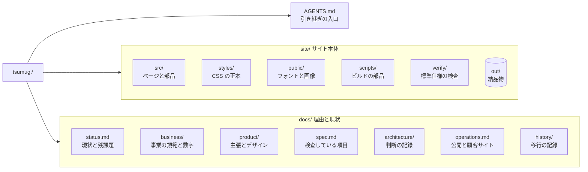
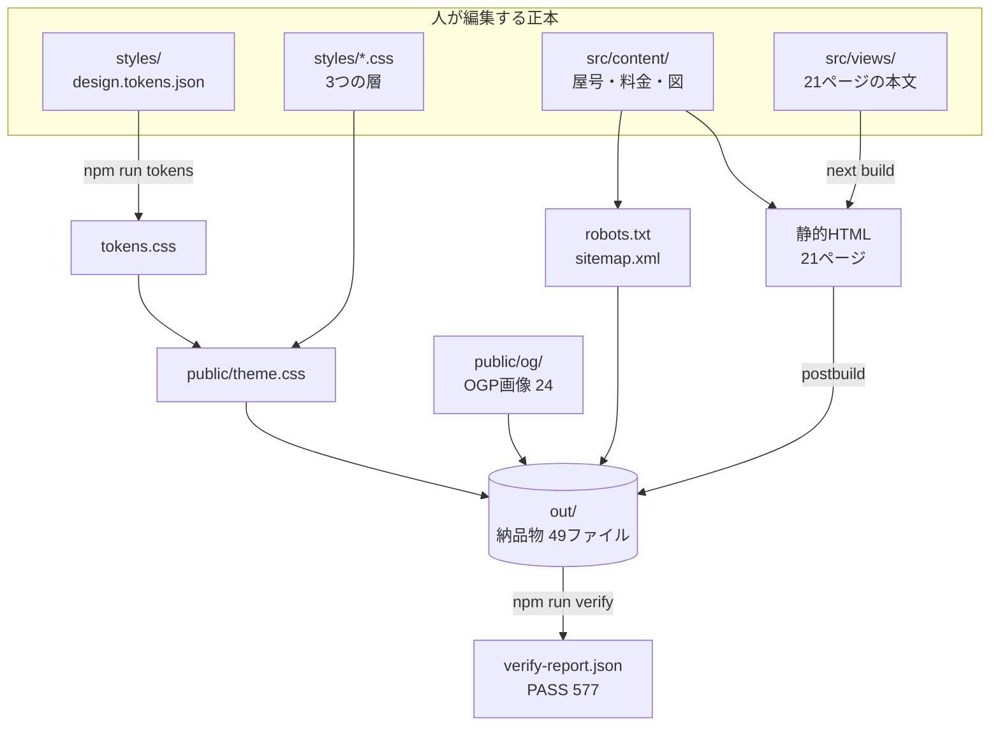
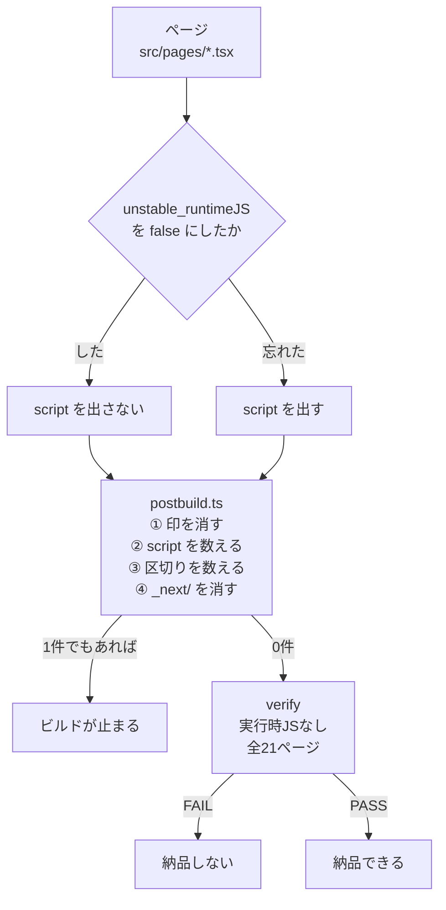
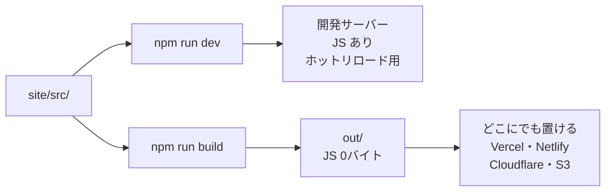
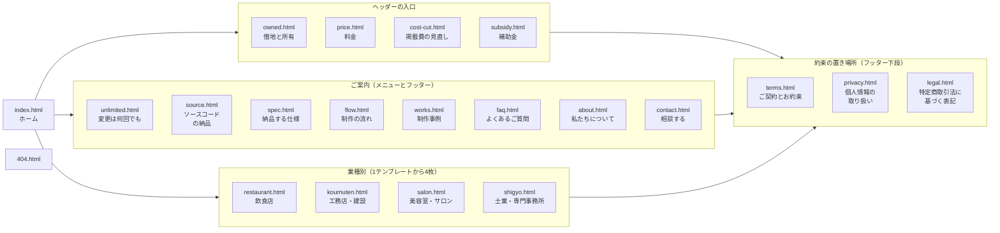
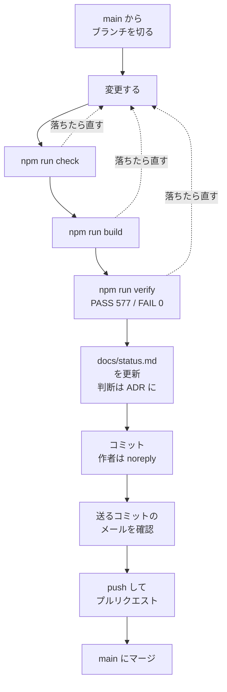
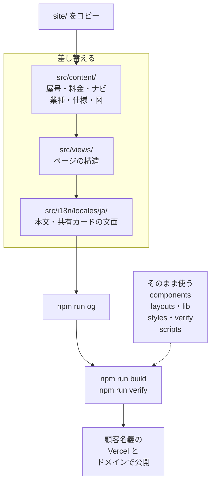
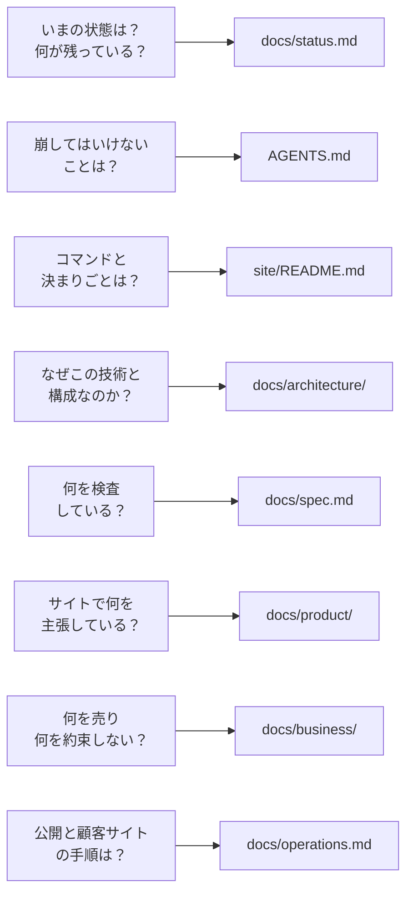

# 紬（つむぎ）サービスサイト

小規模事業者向けホームページ制作「紬」の自社サイト。21ページ。
**実行時 JavaScript 0バイト**が製品の主張そのものなので、そこを崩す変更はしない。

> **開発を引き継ぐとき（人・AI）は、まず [AGENTS.md](AGENTS.md) と [docs/status.md](docs/status.md) を読む。**

| | |
|---|---|
| 何のサイトか | 飲食店・工務店・美容室・士業向けのホームページ制作と運用。**顧客に納品するサイトのテンプレートも兼ねる** |
| 主張 | 「いまのホームページは借地権、紬がつくるのは所有権」 |
| 技術 | Next.js 16（Pages Router）+ React 19 + TypeScript → **静的 HTML** |
| 納品の条件 | 自動検査 **577 項目で FAIL 0** |
| 実行時 JS | **0 バイト**（全21ページ） |

**目次**：[1. リポジトリの地図](#1-リポジトリの地図) ／ [2. ソースから納品物まで](#2-ソースから納品物まで) ／ [3. 0バイトの守り方](#3-0バイトの守り方) ／ [4. サイトの構成](#4-サイトの構成) ／ [5. 動かす](#5-動かす) ／ [6. 変更の進め方](#6-変更の進め方) ／ [7. 顧客サイトを作るとき](#7-顧客サイトを作るとき) ／ [8. どの文書を読むか](#8-どの文書を読むか)

---

## 1. リポジトリの地図



| 置き場所 | 何があるか | 詳しくは |
|---|---|---|
| `AGENTS.md` | 崩してはいけないこと・合格ライン・進め方・はまりどころ | [AGENTS.md](AGENTS.md) |
| `site/` | サイト本体。コードを触るときの決まり | [site/README.md](site/README.md) |
| `docs/` | 仕様・判断の理由・事業の文書・現状と残課題 | [docs/README.md](docs/README.md) |

---

## 2. ソースから納品物まで

人が編集するのは上段の**正本**（4つ）だけ。それより下はすべて生成物で、`out/` をそのまま置けば公開できる。



- **金額の正本は `site/src/content/prices.ts` の1か所。** ページも検査も OGP 画像もここを読む。`docs/business/紬_事業の中身.xlsx` は写しで、Excel を直してもサイトは変わらない
- **CSS の正本は `site/styles/`。** `public/theme.css` は4枚を束ねた生成物
- ビルドの4段階と検査の中身は [site/README.md](site/README.md) に図がある

---

## 3. 0バイトの守り方

「実行時 JS 0バイト」は売り文句なので、**うっかり崩れても必ず止まる**ように3重にしてある。



**App Router ではなく Pages Router を使っている理由**（Next.js 16.3.5・静的書き出しで測定）

| | HTML の `<script>` | 配られる JS（gzip） |
|---|---|---|
| App Router | 8 | **約173KB（全ページ・減らせない）** |
| **Pages Router ＋ `unstable_runtimeJS: false`** | **0** | **0 バイト** |

詳しくは [ADR 0001](docs/architecture/0001-pages-router.md)。なお、開発サーバーの HTML にはホットリロード用の JS が入る。**0バイトの対象は `out/`（納品物）。**



---

## 4. サイトの構成

21ページ。ヘッダーの入口は4本だけで、**約束を書いた3枚は全ページのフッターから1タップ**で届く（検査「25 必須ページ」）。



---

## 5. 動かす

```bash
cd site
npm install
npx playwright install chromium   # 検査と OGP 画像の生成に使う（初回だけ）
npm run dev       # http://localhost:3000（使われていたら npm run dev -- -p 3001）
npm run check     # 型検査 ＋ 依存の向き
npm run build     # → out/
npm run verify    # PASS 577 / WARN 1 / FAIL 0 なら納品可
```

WARN 1 は `PLACEHOLDER=true`（電話番号・住所が仮）。公開前に潰す既知の1件（[公開前にやること](docs/operations.md)）。
ほかのコマンド（`tokens`・`og`・検査のオプション）は [site/README.md](site/README.md)。

---

## 6. 変更の進め方



- GitHub のメール保護が有効なので、**個人のメールアドレスが入ったコミットは push できない**。確かめ方：`git log --format='%h %ae %ce %s' origin/main..HEAD`
- 見た目を変えないはずの変更では、`out/` の全ファイルが変更前と同じであることも確かめる
- 詳しくは [AGENTS.md](AGENTS.md)「5. 進め方」「6. はまりどころ」

---

## 7. 顧客サイトを作るとき

このサイトは1号案件で、**そのままテンプレートになる**。差し替える範囲は `src/content/`・`src/i18n/locales/ja/`・`src/routing/`・`src/views/` に分かれている。



- `◯◯.vercel.app` のまま渡さない（「ドメインは初日からお客様の名義」という約束が守れない）
- 手順の詳細は [docs/operations.md](docs/operations.md)、層を分けた理由は [ADR 0004](docs/architecture/0004-content-and-routing.md)

---

## 8. どの文書を読むか



| 文書 | 中身 |
|---|---|
| [docs/status.md](docs/status.md) | 現状と残課題（作業を終えたら更新する） |
| [AGENTS.md](AGENTS.md) | 崩してはいけないこと・合格ライン・進め方・はまりどころ |
| [site/README.md](site/README.md) | コマンド・ビルドと検査の流れ・書き方と置き場所の決まり |
| [docs/architecture/](docs/architecture/README.md) | 技術的な判断の一覧と ADR |
| [docs/spec.md](docs/spec.md) | 検査している項目と、検査で見つかった不具合 |
| [docs/product/](docs/README.md) | サイトの主張・値付け・デザイン |
| [docs/business/](docs/business/紬_ビジネスガイドライン.md) | 事業の規範と数字（正本） |
| [docs/operations.md](docs/operations.md) | 公開前にやること・顧客サイトの作り方・デプロイ |
| [docs/history/](docs/history/2026-09-migration.md) | Python／Astro から Next.js への移行の記録 |
