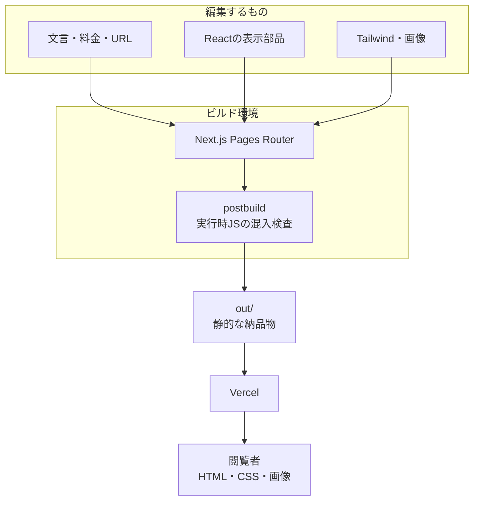
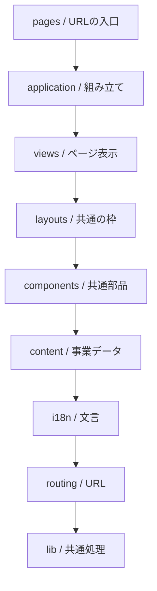
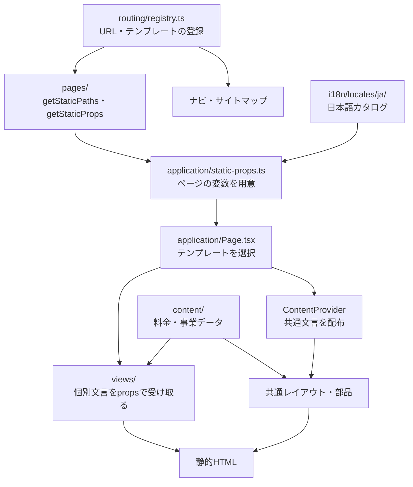
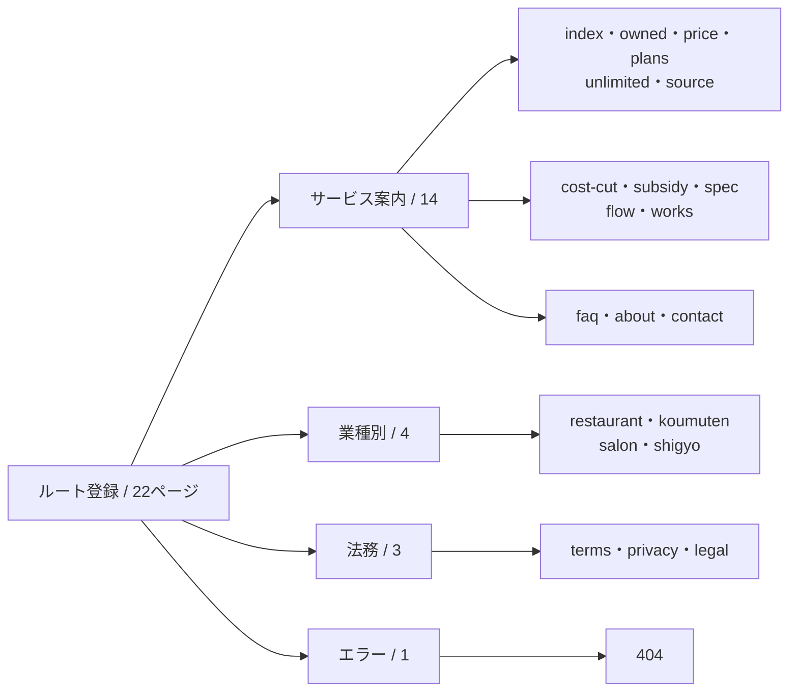
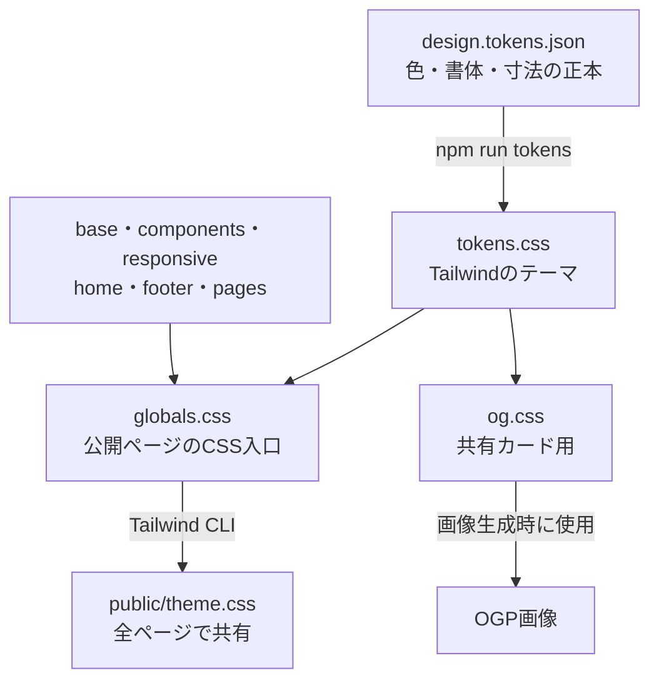
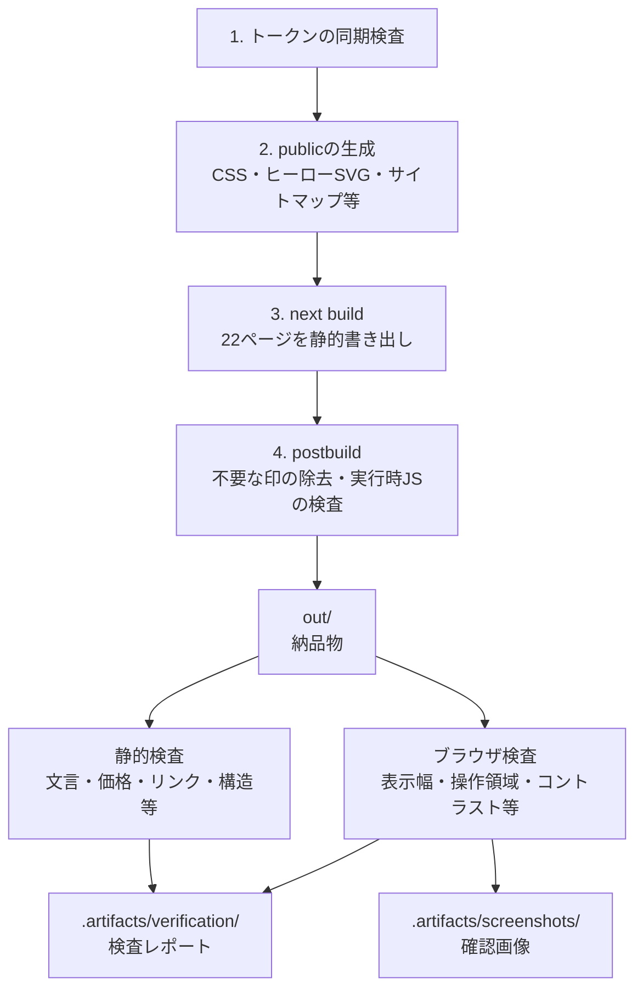
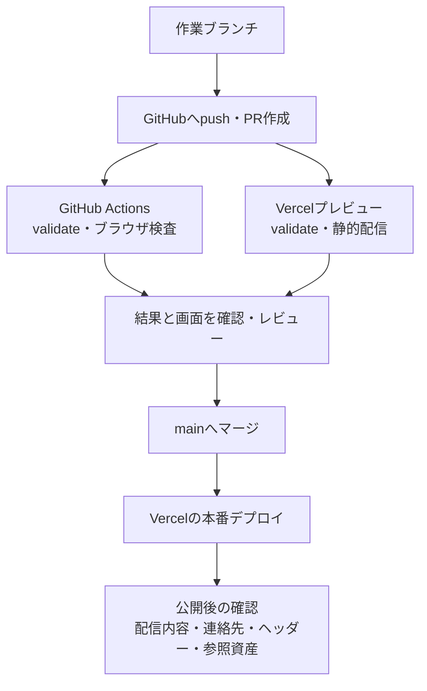

# 紬（つむぎ）

> 大幅なデザイン変更の編集場所・部品の使い方・全ページ比較は [リデザイン手順](docs/product/redesign-guide.md) を参照。

**事業の土台づくりと日々の改善を支えるサービスサイト。**

Next.js・React・TypeScriptで構築し、22ページを静的HTMLとして配信します。文言・料金・URL・見た目を中央管理し、公開ページの**実行時JavaScriptは0バイト**に保っています。同じコードを、顧客サイトのテンプレートとして展開する前提の構成です。

[AI・開発者の引き継ぎ](AGENTS.md) · [再開手順](docs/handoff.md) · [開発を始める](#開発を始める) · [構成を見る](#ディレクトリ構成) · [編集する場所](#変更したいときの入口) · [現在の状態](docs/status.md) · [資料一覧](docs/README.md)

## 現在の提供範囲

自社サイトは [tsumugi-six.vercel.app](https://tsumugi-six.vercel.app/) で公開し、問い合わせは電話・メールで案内します。自社の問い合わせフォーム・オンライン決済・契約締結は設けていません。独自ドメイン取得は自社公開の前提にしません（[公開判断](docs/architecture/0056-owner-authorized-publication.md)）。

CMS・追加言語などは**受付準備中**です。記事の取り込み（microCMS）・言語ごとのビルド・問い合わせ受付・請求と入金・引渡し資料の仕組みは実装済みですが、実サービスの契約と配備、実データでの確認が終わるまで商品としては提供しません。仕組みがあることと、サービスを提供できることは区別します。機能ごとの不足は [機能監査](docs/product/feature-audit-2026-09-18.md)、Issueの判断は [再整理一覧](docs/product/issue-review-2026-09-18.md)、直近の検証・main反映状況は [現状と残課題](docs/status.md) を参照してください。

自社リポジトリは非公開です。顧客へのソース納品・閲覧招待は、自社サイトのソース公開とは別に扱います。

## 全体像

Reactはビルド時にHTMLを作ります。閲覧者にはHTML・CSS・画像を届け、リンクやメニューはブラウザ標準の機能で動かします。



| 役割             | 採用しているもの                           |
| ---------------- | ------------------------------------------ |
| ページ生成       | Next.js 16 / Pages Router・React 19        |
| 型とデータ検証   | TypeScript・Zod                            |
| 見た目とアイコン | Tailwind CSS 4・LucideのSVG                |
| 品質確認         | ESLint・Knip・Vitest・Playwright・独自検査 |
| 開発・公開       | Node.js 24・npm 12・GitHub Actions・Vercel |

正確な依存バージョンは [package.json](package.json) と [package-lock.json](package-lock.json) が正本です。TypeScriptのCLIと検査ツール用APIを併用する理由は [ADR 0003](docs/architecture/0003-modern-stack.md) にまとめています。

## ブランドの配色

| メイン70%            | サブ20%                | アクセント10%          |
| -------------------- | ---------------------- | ---------------------- |
| アイボリー `#FFF8ED` | エスプレッソ `#302820` | 琥珀 `#FFB000`         |
| 背景・余白           | 文字・説明の章         | 主要ボタン・料金・相談 |

比率はイラストを除くUI面積の目安です。3色の正本と派生トークンを中央管理し、ヘッダーからフッター、共有カードまで揃えています。[配色ルール](docs/product/design.md#3色の使い方と721) · [判断と検証](docs/architecture/0016-warm-base-palette.md)

## ディレクトリ構成

単一アプリをリポジトリのルートから操作します。`src/` に実装、`tools/` に開発と検査、`docs/` に仕様と判断を置きます。

```text
.
├── src/                        アプリケーション
│   ├── pages/                  URLの入口・静的生成
│   ├── application/            ページデータと表示の組み立て
│   ├── views/                  ページごとの表示
│   ├── layouts/                共通レイアウト
│   ├── components/             ヘッダー・フッター・図解等の部品
│   ├── content/                料金・事業設定・図解データ
│   ├── i18n/                   表示テキストの中央管理
│   ├── routing/                URLとページ分類の中央管理
│   ├── lib/                    共通の小さな処理
│   ├── styles/                 Tailwind・デザイントークン
│   └── assets/                 ヒーロー等の元画像
├── public/                     配信素材と生成済みCSS・画像
├── tests/                      アプリと開発基盤のテスト
├── tools/
│   ├── scripts/                起動・生成・構造と文書の検査
│   ├── design/                 全ページの変更前後比較
│   ├── verify/                 納品物の検査・ブラウザ実測
│   ├── pricing/                事業の料金・工数モデル
│   ├── ops/                    社内CLI・公開監視・バックアップ・引渡し資料
│   ├── security/               静的配信とブラウザの安全性検査
│   └── paths.ts                ルートと生成物の共通パス
├── services/inquiry/           顧客向け受付のコア（本番接続は未完了）
├── config/                     ESLint・Knip・Vitest・Prettierの設定
├── docs/                       開発・仕様・設計判断・事業資料
├── .github/                    CI・定期実行（監視・見張り・作り直し・配信照合・バックアップ）・Dependabot
├── .data/                      社内ツールの業務データ（Git管理外）
├── .artifacts/                 レポート・検査画像（Git管理外）
├── out/                        静的な納品物（Git管理外）
└── .next/                      Next.jsの生成物（Git管理外）
```

`package.json`・`next.config.ts`・`tsconfig.json`・`vercel.json` はツールが設定を見つける起点としてルートに残しています。配置の理由は [ADR 0012](docs/architecture/0012-root-project-layout.md) を参照してください。

### コードの依存方向

矢印は**参照できる方向**です。途中の層を飛ばして下流を参照できますが、逆向きの参照と循環は禁止しています。`@/` は `src/` を指します。



この境界は `npm run check` が検査します。未使用コードの再混入も同じコマンドで検出します（[ADR 0013](docs/architecture/0013-dead-code-cleanup.md)）。`styles/` と `assets/` は表示資源として分けており、上のコード層には含めません。

## 変更したいときの入口

ページに同じ値を繰り返し書かず、まず正本を変更します。

| 変更したいもの                     | 編集する場所                                                                      |
| ---------------------------------- | --------------------------------------------------------------------------------- |
| 見出し・本文・SEO・図のラベル      | [src/i18n/locales/ja/](src/i18n/locales/ja/)                                      |
| 金額・プラン・価格計算             | [src/content/prices.ts](src/content/prices.ts)                                    |
| 連絡先・プロフィール               | [src/i18n/locales/ja/config.ts](src/i18n/locales/ja/config.ts)                    |
| ドメイン・フォーム送信先・公開設定 | [src/content/config.ts](src/content/config.ts)                                    |
| ページのURL・アイコン・ナビ分類    | [src/routing/registry.ts](src/routing/registry.ts)                                |
| ページの構造・共通部品             | [src/views/](src/views/)・[src/components/](src/components/)                      |
| 色・書体・寸法                     | [src/styles/design.tokens.json](src/styles/design.tokens.json)                    |
| レイアウト・装飾・レスポンシブ表示 | [src/styles/](src/styles/)                                                        |
| SVG 図解の形・座標                 | [src/components/diagrams/](src/components/diagrams/)                              |
| ヒーローの元画像                   | [src/assets/hero/](src/assets/hero/)                                              |
| 事業の工数・収支の仮定             | [tools/pricing/](tools/pricing/)・[料金設計](docs/business/pricing-2026-09-18.md) |

[2026-09-18の採用料金](docs/business/pricing-2026-09-18.md)と[改定前の費用総点検](docs/business/cost-review-2026-09-18.md)に、採用料金と改定前の検討経緯、工数試算・外部費の確認事項をまとめています。

事業資料のExcelは価格の写しです。Excelを直してもサイトの料金は変わりません。`out/`、`public/theme.css`、`src/styles/tokens.css` は生成結果なので手で編集しません。

## ページができるまで

URLの登録と文言をもとに、ビルド時にページ用の変数を用意します。個別の文言はprops、共通部品の文言はContentProviderを通して渡します。



公開しているのは**日本語のみ**です。言語ごとにビルドして追加言語を `/en/` のような配下へ出す仕組みと、翻訳の突き合わせ・言語ごとの検査は実装済みで（[ADR 0081](docs/architecture/0081-build-time-locales.md)）、実際の翻訳を受け取ってから公開します。ヒーローも背景画と文字を分離し、見出し・本文をカタログからHTMLとして描画します。電話番号・メール・郵便番号もカタログに集約しています。金額・計算は `src/content/prices.ts`、URLはルート設定で管理します。

### ページの地図

22ページは、サービス案内14・法務3・業種別4・404ページ1で構成します。以下は分類の図で、すべてのリンク関係を表すものではありません。



公開URLは `/price.html` のような形式です。業種別4ページは共通テンプレートを使います。新しいページの追加手順は [開発ガイド](docs/development.md#ページを追加するとき) を参照してください。

## 見た目の中央管理

色・書体・寸法をデザイントークンにまとめ、ページと共有カード画像で使います。公開ページのCSS入口は `globals.css` です。



トークンを変更したら `npm run tokens`、CSSのコンパイルだけなら `npm run styles` を使います。`npm run dev` はテーマ生成とCSS監視も起動します。OGP画像の再生成には書体環境の条件があるため、実行前に [OGPの環境条件](docs/architecture/0047-og-image-environment.md) を確認してください。

## 開発を始める

すべてリポジトリルートで実行します。Node.jsは [.nvmrc](.nvmrc) に合わせます。

```sh
nvm install && nvm use
npm install --global npm@12.0.2
npm ci
npm run dev
```

通常の確認先は `http://localhost:3000`。3001番で起動する場合は次を使います。

```sh
npm run dev -- --port 3001 --hostname 127.0.0.1
```

開発サーバーには更新通知用のJavaScriptが含まれます。**0バイトを確認する対象は、ビルド後の `out/` です。**

## ビルドと品質確認

`npm run build` は4段階で公開ファイルを作り、検査に失敗すると停止します。



| コマンド                              | 確認するもの                                                     |
| ------------------------------------- | ---------------------------------------------------------------- |
| `npm run check`                       | 型・依存方向・文言とURL・CSSの中央管理・文書の参照・未使用コード |
| `npm run check:unused`                | 未使用のファイル・export・型・依存関係（`check` に含む）         |
| `npm run lint`                        | コードの規約                                                     |
| `npm test`                            | アプリと開発基盤の単体テスト                                     |
| `npm run test:pricing`                | 事業の料金・工数モデル                                           |
| `npm run validate`                    | check・lint・両単体テスト → ビルド → 安全性・静的検査            |
| `npm run verify`                      | 生成済みの `out/` をブラウザ実測も含めて検査（既定はプレビュー） |
| `npm run verify -- --mode production` | 本番の公開条件を含めた全項目検査                                 |
| `npm run test:security-browser`       | ブラウザでCSPの正常表示・攻撃遮断を検査                          |

変更を出す前は次の順で確認します。`verify` 自体はビルドを行いません。

```sh
npm run validate
PLAYWRIGHT_SKIP_BROWSER_GC=1 npx playwright install chromium  # 初回・Playwright更新時
npm run verify -- --mode production
```

検査の条件は [仕様](docs/spec.md)、直近の検証結果と既知の警告は [現在の状態](docs/status.md) に集約しています。FAILがある場合は納品しません。JSON-LDは構造化データとして許容し、それ以外の実行時スクリプトの混入を検査します。

## GitHubから公開まで

ブランチを作ってPRを出し、CIとプレビューを確認してから `main` にマージします。図の各工程はリリースの流れであり、GitHubのブランチ保護による強制を示すものではありません。



VercelはRoot Directoryを未指定（リポジトリルート）とし、`npm run validate` で作った `out/` を配信します。手動プレビューは `npm run deploy:preview`。配備設定は [vercel.json](vercel.json)、公開手順は [運用ガイド](docs/operations.md) を参照してください。

専門家による契約文面確認と人による受入確認は未完了です。紬の自社公開に限るオーナー判断を本番検査のWARNに残し、確認済みとは扱いません。顧客テンプレートへ転用する場合は `OWNER_PUBLICATION=null` に戻し、顧客案件の公開・納品条件で検証します。プレビュー成功・mainへのマージ・実公開の確認はそれぞれ別の証跡です。

全22ページの役割、共通化する情報と各ページに残す条件は [情報設計](docs/product/information-architecture.md) にまとめています。

## 公開後の運用と社内ツール

| 用途                                                                              | コマンド・入口                                                                |
| --------------------------------------------------------------------------------- | ----------------------------------------------------------------------------- |
| 公開先のページ・ヘッダー・直接参照するCSS/画像の確認                              | `npm run check:live -- --url <公開URL>`                                       |
| 定期監視と同じ検査（CSS の中から参照される書体・画像を含む）                      | `npm run monitor -- --url <公開URL>`                                          |
| 監視そのものが止まっていないかの見張りと、復旧の連絡                              | `npm run watchdog`（Monitor watchdog が6時間ごとに実行）                      |
| 日付で変わる案内（臨時休業・臨時の営業時間）の作り直し                            | `npm run refresh`（Daily refresh が毎日 0:10 に実行）                         |
| 公開に使った成果物と配信内容の照合                                                | `npm run check:release -- --url <公開URL> --dist <成果物のディレクトリ>`      |
| Gitのバックアップと復元リハーサル                                                 | `npm run backup` / `npm run backup:restore-test -- --backup <バックアップ先>` |
| 見積・請求と入金・依頼/工数・CRM・引渡し資料・指標・月次レポート・営業リスト・GBP | [社内CLIの使い方](tools/ops/README.md)                                        |

監視が止まったこと自体は Monitor watchdog が検出し、障害の issue を立てて復旧で閉じます（[ADR 0083](docs/architecture/0083-monitor-watchdog.md)）。ただし同じ GitHub Actions の上で動くため、GitHub の外からの独立した監視は別に用意します。通知の到達、独立したバックアップ保管先、非公開業務データの保全は個別に確認します。Gitのバックアップだけで業務データまで復元できるとは扱いません。設定と復旧手順は [運用ガイド](docs/operations.md) を参照してください。

社内CLIのデータは `.data/`、`.artifacts/` またはリポジトリ外に保存します。同じ保存先への操作は排他制御し、競合時は保存せず停止します。強制終了後のロックは自動削除せず、手順に従って実行元の停止を確認します。

新規見積の保存には顧客・案件IDが必要です。CRMへの紐付けと、見積提出・契約済み・制作中への進行時に実ファイル・番号・版・顧客・案件を照合します。帰属のない旧データは自動移行しません。CLIの検査は利用者の認証・権限管理の代わりにはなりません。詳細は [ADR0072](docs/architecture/0072-local-ops-command-lock.md)・[0073](docs/architecture/0073-estimate-customer-project-binding.md)・[0074](docs/architecture/0074-crm-transition-estimate-validation.md) に記録しています。

## 目的別のドキュメント

| 知りたいこと                           | 読む文書                                                     |
| -------------------------------------- | ------------------------------------------------------------ |
| 開発を引き継ぐ・守る決まりを確認する   | [AGENTS.md](AGENTS.md)                                       |
| 今の状態・残課題・検証結果を知る       | [docs/status.md](docs/status.md)                             |
| コードの書き方・ページの追加方法を知る | [開発ガイド](docs/development.md)                            |
| なぜこの設計にしたかを知る             | [設計判断とADR](docs/architecture/README.md)                 |
| 納品の条件を確認する                   | [仕様](docs/spec.md)                                         |
| サイトの目的・顧客サイトへの展開を知る | [プロジェクト概要](docs/product/project-overview.md)         |
| 事業・料金・契約の方針を確認する       | [事業ガイドライン](docs/business/紬_ビジネスガイドライン.md) |
| 資料全体から探す                       | [docs/README.md](docs/README.md)                             |
