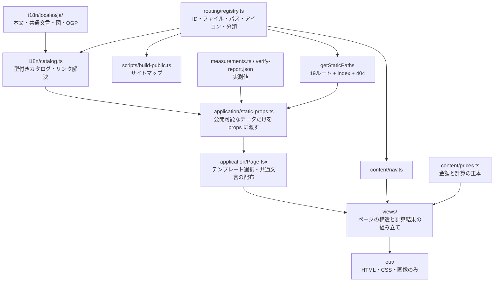

# 0004 文言をビルド時に解決し、ルートを一元管理する

- 状態：採用（2026-09-14）。0002 のディレクトリ構成を置き換える
- 制約：日本語の21ページ、既存の `.html` URL、Pages Router、公開時 JavaScript 0 バイトを維持する

## 問題と決定

文言がページ・共通部品・事業データ・SVG・OGP生成に分散し、ページ一覧もナビと静的生成で重複していた。電話リンクにも複数の実装があり、表示番号と発信先の桁数まで異なっていた。

文言の正本を `src/i18n/locales/ja/`、ルートの正本を `src/routing/registry.ts` にする。金額・計算・実測値は翻訳から分離する。電話リンクは `PhoneLink` に統一し、アイコンと番号だけを表示する。発信先は表示番号から作る。

## 境界と依存

`pages → application → views → layouts → components → content → i18n → routing → lib`

- `pages/` は Next.js の入口だけ。`index.tsx`・`404.tsx`・`[page].tsx` が静的生成と JavaScript 無効化を宣言する。
- `application/` はビルド入力とテンプレートの組み合わせ。`app/` という名前を使うと Next.js の App Router と衝突するため使わない。
- `views/` はテンプレート名で型を限定した props から、そのページの文言だけを受け取る。全カタログを各ページに渡さず、共通文言7名前空間と当該ページの文言に絞る。64 KiBをページ入力の上限としてテストする。ヘッダーなどの共通部品は、その props を `ContentProvider` で受け取る。Provider は静的描画時にだけ動く。
- `content/` は設定・数値・計算・業種構造・図の描画。表示文字列はカタログから読む。翻訳カタログには計算処理を入れない。
- `i18n/` は文言と名前付き差し込み。URL を含む本文では `@route:terms` のような識別子を使い、ビルド時に解決する。
- `routing/` はページを描画せず、フレームワークにも依存しない。未登録 ID は拒否する。
- `scripts/` と `verify/` は下位のデータ・文言・ルートを利用できる。ページや表示部品には依存しない。

型検査に加え、import・再export・動的importを構文解析して依存方向と循環を検査する。本文・表示用属性への直接記述、カタログ外の日本語文字列、直接のページ URL は `check-content` で止める。

## 文言の編集

ページ別の名前空間と安定したキーを使う。見出し・段落・表・強調部分ごとに既存の構造を保つ。キーは文言変更や並べ替えで改番しない。繰り返し番号は配列の添字として参照せず、固定キーとして扱う。

ブランドの呼称は `@brand:name` で共通設定を参照する。

金額や日数を含む文は `format(copy.heading, { amount, months })` で1つの文字列にする。差し込み名は型検査し、未指定の値は実行時にもエラーにする。値の再評価・再帰的な差し込みはしない。

`<strong>`・` ` など本文の意味を持つマークアップはカタログに残す。SVG の座標・色・図形は描画側に置く。HTML として描画する文言はリポジトリ管理の信頼済みデータに限定する。外部フォームや未検証の CMS 文字列を渡す設計ではない。

実測更新は `content/measurements.ts` の数値だけを書き換え、説明文の翻訳は変更しない。事業者情報と連絡先は `content/config.ts`、表示用プロフィールは `i18n/locales/ja/config.ts` を編集する。価格の正本は引き続き `content/prices.ts`。

## ルートと404

ファイル名（`price.html`）、公開パス（`/price.html`）、ページ ID（`price`）を区別する。内部リンクと CSS・アイコンの参照はルート相対に統一し、深い不明 URL で404を表示しても壊れないようにする。canonical と OGP URL、ナビ、サイトマップ、共有カード、静的生成を同じ登録表から組み立てる。

`fallback: false` を維持し、未知の動的パラメーターは `notFound` にする。既存ページのパスの変更やリダイレクトは発生しない。サイトはドメインのルートに配置する。

## 採らなかったもの・今後の拡張

- Next.js 組み込みの国際化ルーティングは static export と併用できないため利用しない。[Next.js の静的書き出し仕様](https://nextjs.org/docs/app/guides/static-exports#unsupported-features)
- ブラウザの翻訳ライブラリ、言語検出、実行時言語切り替えを入れない。現時点の対応言語は日本語のみで、未対応言語を黙って日本語に戻さない。
- 実際に翻訳を追加するときは、カタログのキー・差し込み名の一致、各言語の事業データ表記と数値・日付書式、明示的な言語別の静的パス、canonical・hreflang・OGP、表示幅を同時に検証する。現在の構成は1ビルド1言語である。
- CMS・複数パッケージ・ルートごとの実行サーバーは追加しない。顧客サイトが複数になった段階で共有範囲を見直す。

## 検証

型・依存方向・循環・文言の検査、lint、112件の単体テスト。全21ルートの描画、登録漏れ、シリアライズ、差し込み、電話表示を検査する。

変更前 `044bcdd` の出力49ファイルを保存して比較。電話リンク、ルート相対への変更、実測レポート由来の件数、不要な電話ラベルの CSS 削除だけを意図した差分として扱う。画像は再生成せず同一バイトを保つ。

電話の補助ラベルを削除した結果、実在するコントラスト検査対象が111件から107件へ減るため、全体は581 PASSから577 PASSになる。検査条件を緩めたものではない。
