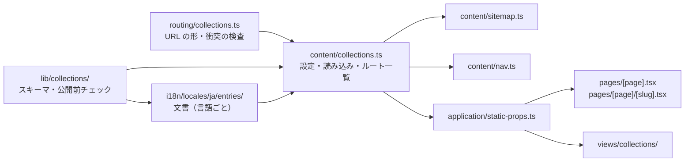

# 0040 記事・事例・対応エリア・顧客事例を共通のコレクションとして静的生成する

- 状態：採用（2026-09-16）
- 関連：[#16](https://github.com/bright-broom/tsumugi/issues/16)・[#17](https://github.com/bright-broom/tsumugi/issues/17)・[#18](https://github.com/bright-broom/tsumugi/issues/18)・[#38](https://github.com/bright-broom/tsumugi/issues/38)。絞り込みは [0041](0041-css-case-filter.md)、対応エリアは [0042](0042-service-area-pages.md)、顧客事例は [0043](0043-client-work-records.md)
- 制約：Pages Router・実行時 JavaScript 0 バイト・依存の向き（[0004](0004-content-and-routing.md)）・既存の OGP 画像を再生成しない

## 背景

料金表は、記事・事例・対応エリアのページを顧客サイトの機能として挙げている。ルートは `routing/registry.ts` の固定 21 本だけで、一覧と詳細を生成する経路がなかった。紬の自社サイトには載せる記事・事例・地域がないため、**紬の出力は変えずに、顧客サイトで中身を入れたときだけページが生まれる**仕組みにする。

## 決定

### 1 つのエンジンに 4 種類を載せる

`src/lib/collections/` に、サイトに依存しない共通部分（zod のスキーマ・公開前チェック・並び順・slug の重複検出）を置き、その上に 4 種類を定義する。

| 種類 | 固有の項目 | 公開 URL |
|---|---|---|
| articles（お知らせ・コラム） | 種別、本文、入稿枠 | `/news.html`・`/news/<slug>.html` |
| cases（施工事例・取扱分野） | 業種ごとの分類と詳細項目、地域、写真 | `/cases.html`・`/cases/<slug>.html` |
| areas（対応エリア） | 都道府県・市区町村・対応可否・固有の本文 | `/areas.html`・`/areas/<slug>.html` |
| works（紬の顧客事例） | 測定値・掲載許可・確認できた結果 | 既存の `works.html` の区画・`/works/<slug>.html` |

共通の項目は slug・`status`（`draft` / `published`）・タイトル・公開日・更新日・並び順・画像（`src`・`alt`・幅・高さ）・SEO（タイトル・説明・任意の共有画像）。本文は見出し・段落・箇条書き・画像の**構造化ブロック**で持ち、React が文字をエスケープする。HTML 文字列や Markdown は受け取らない（`raw()` の信頼済み本文を増やさない・依存を足さない）。

### 置き場所と依存の向き

- 文書は言語に属するので `i18n/locales/ja/entries/` に置く。カタログと同じ解決（和欧文の半角スペース・`@route:`）を通り、`check-content` の対象外になる。日付・数値も文書の一部として同じファイルに持つ（1 件を 2 つのファイルに分けると入稿で取り違える）。
- URL の土台・一覧を作るか既存ページに添えるか・アイコン・代替の共有カードは `content/collections.ts` の設定。別の案件はここと文書を差し替え、エンジンは変えない。
- `routing/` は URL の形（`<base>.html`・`<base>/<slug>.html`）と、固定ルート・予約名（`og`・`images` など）との衝突だけを扱う。固定の登録表は変えない。

### 公開の条件

- **`status: 'published'` で公開前チェックを通ったものだけ**がルートになる。タイトル・説明（40〜160 文字。検査の WARN 範囲に合わせる）・公開日・本文・画像の代替テキスト・入稿枠の仮 slug などが足りなければ、`content/collections.ts` の読み込み時に例外を投げてビルドが止まる。壊れたページを出して後で直す運用にしない。
- 下書きは一覧・詳細・sitemap・ナビのどこにも出ない。公開 0 件のコレクションは一覧ページも作らない（空の一覧を公開しない）。
- 公開日による予約公開はしない。ビルドした時刻で出力が変わると、同じ入力から同じ出力を得る前提（ハッシュ比較）が崩れるため。予約公開が必要になったら、配備の起動側（#15 の管理画面・定期ビルド）で扱う。

### ルート・sitemap・canonical・OGP・ナビ

- `pages/[page].tsx` の `getStaticPaths` に公開中の一覧を加え、詳細は新設の `pages/[page]/[slug].tsx` が出す。`fallback: false` を維持し、公開していない slug は 404。
- sitemap は `content/sitemap.ts` が作る。固定ページの後に、公開中のコレクションのページを `lastmod`（更新日か公開日）付きで並べる。
- canonical は各ページのファイル（`news/<slug>.html`）から、固定ページと同じ `canonical()` で作る。
- 共有画像は、項目の `seo.ogImage`（`public/og/` にある PNG）か、コレクションごとに決めた**既存のカード**（記事・事例・エリアは `og/index.png`、顧客事例は `og/works.png`）。新しい PNG は生成しない（#37 の書体確定まで）。
- 公開中の一覧は、ヘッダーのメニューとフッターが共有する「相談・依頼を進める」グループの「制作事例」の後に並ぶ。ヘッダーの部品自体は変えない。
- `postbuild` と `verify` の静的検査は、HTML を下の階層まで拾う。入れ子のページにも実行時 JS 0・内部リンク・OGP・h1・title/description の検査がかかる。

### 入稿枠（#16）

`entries/articles.ts` に、初期記事 3 本（`initial-1`〜`3`）とプランで追加する 3 本（`additional-1`〜`3`）の空の下書きを置く。本文は書かない。`npm run check` に含めた `check:collections` が、枠ごとに公開までに埋める項目を一覧にし、公開にした項目の不足は FAIL にする。

## 紬の出力への影響

紬の文書は下書きの入稿枠 6 本と空のデータだけなので、生成されるコレクションのページは 0 件。21 ページの HTML・画像・sitemap は変更前とバイト単位で一致する。`theme.css` には一覧・詳細・絞り込みのスタイルが加わる（全ページ共通のスタイルシートのため）。

## 検証

`tests/fixtures/collections.ts` の架空のデータ（「架空」「テスト用」と明記。`src/` から参照しないので `out/` に出ない）で、生成・一覧・詳細・下書きの除外・sitemap・ナビ・共有カードの代替・内部リンク・h1・JS なし・入力の大きさ・追加／更新／非公開を検査する（`tests/collections.test.tsx`）。

2026-09-16 に、文書の入口を一時的にフィクスチャへ差し替えて `npm run build` と `npm run verify -- --static` を通し、確認後に元へ戻した（差し替えはコミットしていない。画像はフィクスチャに実物がないため既存の `/images/onokoro-hero.svg` を指した）。

- `postbuild`：32 ページ（固定 21・一覧 3・詳細 8）、実行時 script 0 件・区切りコメント 0 件
- canonical・`og:url` は `https://example.jp/news/fixture-news-1.html` のように入れ子のパス、`og:image` は `og/index.png`（顧客事例は `og/works.png`）
- sitemap は固定ページの後に 11 行を `lastmod` 付きで出力、フッターとメニューに一覧 3 本へのリンク
- 静的検査：PASS 540 / WARN 2 / FAIL 0。増えた WARN は `index.html` のページ容量 100.4 KB（上限 100 KB）。一覧 3 本のリンクがメニューとフッターに加わり、全ページが少しずつ大きくなるため。**顧客サイトで一覧を 3 本とも公開する場合は、トップページの容量を先に確認する**（ナビに出す一覧を絞るか、トップページの本文を見直す）

戻した後の紬のビルドは、変更前と比べて `theme.css` 以外の 49 ファイルが SHA-256 で一致し、静的検査は PASS 358 / WARN 1 / FAIL 0。

## 後続の機能への使い方

- **スタッフ紹介（#19）・お客様の声（#20）**：共通の項目に、写真と掲載許可（顧客事例の `permission` と同じ形）を足した種類として載せられる。
- **多言語（#23）**：`locales/<言語>/entries/` に同じ slug の文書を置き、言語別の土台 URL を設定で分ける。
- **管理画面（#15）**：画面が書き出す文書も同じ zod スキーマで検証し、公開前チェックの結果を画面に出せる。
- **店舗情報・構造化データ（#22）**：1 件だけの設定なのでコレクションにはしない。記事の `Article` などのページ別 JSON-LD は、`verify` の構造化データ検査が事業者の JSON-LD を前提にしているため今回は出さず、#22 の共通化で扱う。

## 採らなかったもの

- Markdown / MDX：依存が増え、生の HTML が本文に混ざる経路ができる。
- `news-<slug>.html` のようなフラットな名前：固定ページの名前と衝突し得るうえ、一覧と詳細の関係が URL から読めない。入れ子の `.html` もどのホスティングで動く。
- 外部 CMS・実行時のデータ取得：実行時 JS 0 バイトと、ビルド時に検査してから配る方針に反する。
