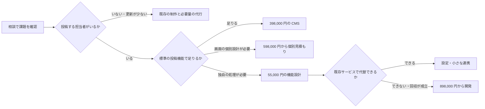

# 紬の上位商品設計 — 更新できるサイトから、業務を支える仕組みへ

作成：2026-09-17。**検討案。未採用・未発売。** 公開料金・既存の契約条件は変更していない。

## 1. 経営判断の要旨

1. 79,800 円・198,000 円は維持する。React / TypeScript / Next.js は現在も制作に使っているため、言語だけを理由に上位料金へ分けない。
2. 最初に商品化するのは、既存の **398,000 円「情報を育てる」**。対象は「担当者が自分で事例・商品・お知らせを追加したい事業者」。CMS 自体ではなく、情報の設計から公開・引き継ぎまで動く状態を納品する。
3. 398,000 円は共通構成を利用する定型商品に限定する。完全な個別デザインや複雑な移行は含めない。個別設計の CMS サイトは **598,000 円〜の見積例**とし、料金カードを増やさない。
4. 独自機能は **898,000 円〜を検証用の基準価格**にする。前案の 698,000 円で幅広い開発を請け負う設計は採用しない。先に 55,000 円の有料設計で課題・代替手段・完成条件を確定する。
5. ただし、898,000 円に顧客が納得するかは未確認。必要性・回収の説明が成立しなければ、SaaS 設定や小さな制作へ縮小する。採算下限と市場価格を混同しない。
6. 月の通常予約は制作・継続支援を合計 **約 67 時間以内**を当面の目安とする。現在の 84 時間を最初から売り切らない。

価格だけの追加ではなく、「誰に売るか」「何を納めるか」「どこまで作るか」「月の何件目から断るか」を同時に決める。

## 2. 確認できたこと・判断・未確認事項

| 区分 | 内容 |
|---|---|
| 確認済み・プロジェクト | 1 ページ 79,800 円、最大 6 ページ 198,000 円、CMS 付き最大 9 ページ 398,000 円。最後は受付準備中。支援は 0 / 3,900 / 9,800 / 29,800 円。正本は `src/content/prices.ts` |
| 確認済み・制作方式 | 現在も React / TypeScript / Next.js を使用。自社公開サイトは静的書き出し・実行時 JavaScript 0 |
| ユーザー指定 | 月 140 時間。狙う顧客層は未確定。既存価格を維持して上位商品を検討したい |
| 既存の経営仮定 | 時間原価 5,000 円、固定費 50,000 円/月、決済費 3%、営業・事務 28 時間、予備 28 時間。実績ではない |
| 本提案の仮説 | 定型 CMS 26 時間、個別 CMS 36 時間、単一業務の機能開発 50 時間。再利用できる構成があることが成立条件 |
| 未確認 | 支払意思、受注率、実工数、集客費、更新定着率、顧客の実際の効果、生活費を含む資金余力 |

技術構成が新しいこと、AI で速く制作できること、上位案件の単価が高いことだけでは、顧客の効果も事業の利益も確定しない。

## 3. 市場に対してどこで選ばれるか

公式情報の確認日：2026-09-17。表の事業者名は社内検討用。公開サイトへの転載は想定しない。価格・税・含まれる役務が異なるため、単純な最安比較は行わない。

| 選択肢 | 公式情報から確認できたこと | 紬の判断 |
|---|---|---|
| Studio で制作・運用 | Business は年払い月換算 3,980 円、月払い 5,460 円。CMS を含む。HTML の外部エクスポート機能は提供されていない [S1][S2] | 自分で制作・更新したい人には有力。紬は実装の引き継ぎ・固有の機能が必要な相手に理由が立つ。更新管理画面だけを希少価値として売らない |
| 月額の制作・更新代行 | 参考サービスは初期 5,000 円、月 9,800 / 14,800 / 19,800 円、月 5 回の更新等を案内。原稿整理・独自デザイン・サーバー等も含む [S3] | 更新担当者がいない顧客には代行型が向く。紬の自己更新プランと同じ役務として比較しない |
| microCMS + 独自サイト | Hobby は法人サイトでも利用可。20 GB/月を超えると API 停止。Team は税別月 4,900 円〜 [S4][S5] | CMS 費は一律有料にせず、制約と必要機能で選ぶ。無料利用時にも書き出し・復元・上限監視の設計が必要 |
| Vercel | Pro は月 20 米ドルから。Hobby は個人・非商用に制限 [S6][S7] | 顧客名義の商用契約を前提に必要座席・利用量・為替を見積もる。上位プランにも無料ホスティングを無条件で約束しない |

**狙う位置は「担当者が自分で日々の情報を更新でき、必要なときに別の技術者へも引き継げる、事業に合ったサイト」。** WordPress 等でも実現できるため独占的な優位性とは主張しない。紬が実際に示せる運用デモ・品質確認・引き継ぎ資料で比較してもらう。

## 4. 最初の顧客仮説

業種の最終決定はまだしない。最初の検証対象は、施工・設備・製造など「事例が受注の判断材料になる事業者」を優先する。採用・研修・専門サービスも候補。以下を満たすかで選ぶ。

| 項目 | CMS 上位プランへ進める目安 | 小さなプランへ戻す条件 |
|---|---|---|
| 更新需要 | 具体的な事例・商品等を継続して追加する予定がある | 年に数回の住所・営業時間変更程度 |
| 担当者 | 投稿する人と確認する人が決まる | 誰も原稿や写真を用意しない |
| 素材 | 直近の事例等を 3 件以上用意できる | 取材・撮影が毎回必要だが予算がない |
| 費用・価値 | 現在の更新費、失注、営業の説明負担等を確認できる | React を使うこと以外に導入理由がない |
| 合意 | 決裁者が範囲・原稿・納期を確認する | 制作中に決裁者や方針が繰り返し変わる |

低頻度更新の飲食店や、SNS・既存予約サービスで十分な事業者にも CMS を必須提案しない。更新する内容のない CMS は、顧客にも紬にも運用負担になる。

## 5. 商品構成と範囲

### 5.1 お客様に見せる構成

| 商品 | 税別価格 | 主な約束 | 提供状態 |
|---|---:|---|---|
| 入口をつくる | 79,800 円 | 支給素材を使い 1 ページで事業を伝える | 現行範囲を維持 |
| 事業の土台をつくる | 198,000 円 | 最大 6 ページでサービス・料金・信頼情報を整理 | 現行範囲を維持 |
| 情報を育てる | 398,000 円 | 担当者自身で情報を追加・更新できる状態を納品 | 提供検証後に受付 |
| 独自の仕組みをつくる | 898,000 円〜・個別見積もり | 合意した 1 つの業務を支える機能を設計 | 最初は有料設計の相談だけ |

料金ページの主なカードは既存の 3 枚。独自機能は下段の別枠へ置く。598,000 円は個別デザイン等が必要な場合の見積例であり、第 5 の定額商品にしない。

全プランで品質・安全性・読みやすさを基準にし、上位だけを「良いコード」とは呼ばない。技術名は実装方式の説明欄に置く。

### 5.2 398,000 円を成立させる納品定義

**共通の構成から選び、サイトと更新の仕組みを調整する商品。完全自由設計ではない。**

| 納品範囲 | 上限・完成条件 |
|---|---|
| ページ | 最大 9 種類の公開画面。例：TOP、サービス、会社情報、問い合わせ、よくある質問、記事一覧/詳細、事例一覧/詳細。公開前に画面一覧で合意 |
| CMS | 1 サービス、投稿の種類 2 つまで。合意した文章・写真・分類を編集する。ページ全体を自由に組み替えるエディタではない |
| 初期登録 | 支給素材から 3 件。以後の投稿件数は画面数と分け、CMS の上限に従う |
| 原稿・デザイン | 現行の土台プランの整理を継承。共通部品から構成し、配色・書体・画像・合意した配置を調整。取材記事・撮影・ロゴ・全面個別設計は別 |
| 更新から公開 | 下書き・公開・取り下げ・エラー通知・再実行の手順を用意。誤公開を戻す手順も確認 |
| 説明 | 操作説明 1 回 60 分以内、画面付き手順書、担当者による実操作 |
| 修正 | 顧客がまとめた確認 2 回。紬の仕様不適合の修補は回数に含めない |
| 引き継ぎ | ソース、顧客アカウント、データ取得手順、公開方法、通常の復元手順。外部サービスのライセンスは明示 |
| 公開後 | 1 回 30 分の利用状況確認を総工数内に含める。継続代行・無制限相談・成果保証は含めない |

法務等の定型画面は顧客確認済みの原稿を別枠で掲載する従来方針を維持する。既存顧客への範囲縮小は行わず、新規見積もりで画面数の数え方を確定する。

**26 時間の設計予算（未検証）**：聞き取り・合意 2、構成・原稿整理 3、画面の調整 6、CMS・公開連携 5、検証 4、説明・引き継ぎ 2、確認修正 3、公開後確認と記録 1。計 26 時間。制作画面を生成する時間だけで測らない。

画像のない下書き、長いタイトル、公開を取り消した記事、外部 API 停止なども確認する。更新後の公開に時間がかかる静的方式では、即時反映を約束せず、実測に基づく目安を説明する。

### 5.3 598,000 円〜と 898,000 円〜の境界

- **598,000 円〜の個別 CMS**：共通画面では要望を満たせないが、公開サイト＋2 種の投稿という範囲で完結する案件。専用の情報設計・主要画面のデザインを含め、総工数 36 時間・現金変動費 40,000 円を仮定する。多言語・特殊移行・追加連携は自動的に含めない。
- **898,000 円〜の機能開発**：1 事業・1 業務・合意した 1 つの利用経路。例は「既存商品データを条件で探す」「決まった価格表で概算を計算し、問い合わせへ進む」。画面・入力項目・外部接続・エラー時の動作を有料設計で確定する。50 時間・現金変動費 50,000 円の仮定。
- 見積もりシミュレーターに契約価格の確定・決済・在庫の確保まで含めない。単なる予約先リンクや既存サービスの埋め込みを、高額な独自開発として売らない。
- 顧客会員・複雑な権限、決済・返金、リアルタイム予約枠、個人情報を蓄積する独自 DB、複数部門の承認は、最初の定型商品の対象外。別の設計・提供能力・運用体制を要する。
- 完全個別・連携多数の案件に「898,000 円で何でも」を約束しない。SaaS の設定で解けるなら、既存の設定サービスや小規模な連携を先に提案する。

## 6. 有料設計を受注の入口にする

無料相談は現行どおり 20 分を目安に、必要性と次の進め方を確認する。詳細な要件定義を無料で延々と行わない。

**機能設計 55,000 円／合計 3 時間以内／1 業務。** 1 回の聞き取り、入力→処理→出力の図、既存 SaaS で代替できるか、実装範囲、完成条件、初期費と継続費の見積書を納品する。実装・詳細な全画面デザインは含めない。調査が 3 時間を超えそうなら追加調査の範囲と金額を先に合意する。

設計書はお客様へ渡す。実装を紬に発注する義務は付けない。同じ設計で 60 日以内に開発契約へ進む場合は、55,000 円を開発総額の内金として扱う案とする。

例：総額 898,000 円なら、設計 55,000 円＋着手時 394,000 円＋検収時 449,000 円。総工数 50 時間・直接費 50,000 円には設計分を含み、価格・工数・原価を二重計上しない。契約へ進まない設計案件は別商品として採算を測る。

## 7. 個別案件と事業全体の採算を分ける

### 7.1 通常の直接原価による計算

既存モデルを使用する。以下はすべて仮定であり、税引後の利益ではない。

`案件の貢献額 = 価格 × 0.97 − 総工数 × 5,000 円 − 現金変動費`

| 商品・条件 | 工数 | 現金変動費 | 案件貢献率 |
|---|---:|---:|---:|
| 79,800 円 | 5.5 時間 | 8,000 円 | 52.5% |
| 198,000 円 | 15 時間 | 15,000 円 | 51.5% |
| CMS 398,000 円・標準化後 | 26 時間 | 30,000 円 | 56.8% |
| CMS 398,000 円・前案 | 30 時間 | 30,000 円 | 51.8% |
| 個別 CMS 598,000 円 | 36 時間 | 40,000 円 | 60.2% |
| 機能開発 698,000 円・前案 | 50 時間 | 50,000 円 | 54.0% |
| 機能開発 898,000 円・本案 | 50 時間 | 50,000 円 | 63.6% |

現金変動費は広告・紹介・外注・案件固有のツール等。本人の営業時間はここに重ねて入れない。外部サービスの顧客直接払いは紬の売上・費用から除く。

### 7.2 営業・予備時間を含む価格の点検

上の案件貢献率 50% だけでは、月の全時間と固定費を回収できるとは限らない。

- 月の経済的な原価基準：140 時間 × 5,000 円＋固定費 50,000 円＝750,000 円
- 契約可能容量：140 − 営業・事務 28 − 予備 28＝84 時間
- 25% の作業増を契約枠内で吸収する通常予約目安：84 ÷ 1.25＝**67.2 時間**
- 通常予約 1 時間に配賦する原価：750,000 ÷ 67.2＝約 **11,161 円**

仮に全体の経済的な余力を売上の 15% 確保したい場合、

`点検価格 = (案件時間 × 11,160.714…＋現金変動費) ÷ (1 − 0.03 − 0.15)`

| 条件 | 点検価格 | 判断 |
|---|---:|---|
| 398,000 円の商品が 26 時間 | 約 390,462 円 | 定型商品なら説明が立つ |
| 同じ商品が 30 時間 | 約 444,905 円 | 単体の貢献率は合格でも、全体の余力目標は薄い |
| 個別 CMS が 36 時間 | 約 538,764 円 | 598,000 円〜を検証する根拠 |
| 独自機能が 50 時間 | 約 741,507 円 | 698,000 円は標準価格として余裕が乏しい。898,000 円を検証 |

これは管理上の配賦計算で、会計上の原価・市場相場・受注できる価格ではない。次の月次計算では 140 時間分を一度だけ引き、配賦原価を再度引かない。15% という目標も今回の仮置きである。

既存の 79,800 円・198,000 円を直ちに値上げする提案ではない。テンプレート・紹介受注・素材支給で時間や獲得費を抑え、実工数超過時は新規見積もりの範囲を調整する。赤字を将来の保守契約で埋める前提にはしない。

### 7.3 月に何を何件受けるか

`月の経済的な余力 = 売上 − 現金変動費 − 決済費 − 固定費 50,000 円 − 本人の全 140 時間 700,000 円`

| 月の構成・全件受注できた仮定 | 売上 | 制作・支援時間 | 全 140 時間等を引いた余力 | 工数 25% 増 |
|---|---:|---:|---:|---|
| CMS 2 件のみ・各 30 時間 | 796,000 円 | 60 時間 | **−37,880 円** | 75 時間・容量内 |
| CMS 2 件・各 26 時間＋土台 1 件 | 994,000 円 | 67 時間 | **139,180 円** | 83.75 時間・容量内 |
| CMS 2 件・各 26 時間＋整える 10 社＋育てる 3 社 | 983,400 円 | 66.25 時間 | **137,798 円** | 82.81 時間・容量内 |
| 698,000 円の開発 1 件＋土台 1 件 | 896,000 円 | 65 時間 | **54,120 円** | 81.25 時間・容量内 |
| 898,000 円の開発 1 件＋土台 1 件 | 1,096,000 円 | 65 時間 | **248,120 円** | 81.25 時間・容量内 |
| 898,000 円の開発 1 件のみ | 898,000 円 | 50 時間 | **71,060 円** | 62.5 時間・容量内 |

月 2 件の CMS を 30 時間から 26 時間へ短縮しても、売上と現金費用が同じなら月次余力自体は増えない。余った時間で追加受注・支援・営業を行って初めて事業へ効く。受注が取れることは別の検証が必要。

13 社の支援がある構成で「制作等が 25% 増え、全支援顧客が各 30 分余分に使う」と 89.31 時間となり、84 時間を超える。通常枠 67 時間も安全保証ではない。同時障害・手戻りは予備枠を含めて再計画し、追加受注を止める。

CMS 1 件＋開発 1 件は基準でも 26＋50＝76 時間。25% 増で 95 時間となるので、当初は同月へ詰め込まない。週ごとの工程・顧客確認待ちも管理し、月合計が入るだけで短納期を約束しない。

一覧の 10 シナリオは [計算表](premium-pricing-scenarios.csv)。計算は既存 `tools/pricing/model.ts` と照合し、主要ケースを独立した算式でも確認した。

### 7.4 受注と入金が続く条件

「CMS 2 件＋土台 1 件」は、月に 3 件の納品を繰り返せる定常状態の例であり、発売初月の売上予測ではない。制作期間と作業時間を分け、顧客の原稿待ち・承認待ちを含む週別の工程表で同時進行数を決める。

仮に正式見積もりからの成約率を 25%、相談から見積もりへ進む割合を 50% と置くと、月 3 件には **見積もり 12 件・相談 24 件**が必要になる。20 分の相談で 8 時間、1 時間の見積もりで 12 時間。営業・事務の 28 時間から残るのは 8 時間で、追客・集客活動・経理をすべて賄えるかは未確認。成約率を上げずに問い合わせだけ増やすと、制作枠を圧迫する。

最初の検証では、相談数・対象条件に合う相談数・見積数・受注数・営業時間・獲得現金費を別々に記録する。CMS の獲得費 20,000 円/件は既存モデルの仮定であり、広告を出せばその金額で獲得できるという意味ではない。初回の対象条件確認、見積もりの定型化、紹介からの相談で営業負担を下げられるか検証する。

入金も売上とは分ける。現行の着手 50%・検収 50%を当てはめると、CMS 2 件＋土台 1 件の着手金は合計 **497,000 円**、残額も 497,000 円。検収が翌月へ延びれば残額の入金もずれる。月次の採算表だけでなく、着手・外注支払・検収・入金を週別に並べる。着手金入金後の制作開始、追加作業の事前合意、原稿遅延時の工程変更を運用条件にする。必要な運転資金は、本人の必要報酬・支払期日・保有資金が未確認なので断定しない。

## 8. 顧客にとって価格差が合理的か

### 8.1 CMS の価値は差額で計算する

土台 198,000 円と CMS 398,000 円の差は 200,000 円。両方に必要なホスティング費を差額へ二重計上しない。

仮の例：月 4 回の更新を外注し、1 回 5,000 円の請求を実際に削減できる。自己更新は月 2 時間、顧客の時間価値は 3,000 円/時間、追加 CMS 費は 4,900 円/月。

- 請求額の削減：20,000 − 4,900＝15,100 円/月
- 自社作業の時間価値を引いた経済的な効果：15,100 − 6,000＝9,100 円/月
- 差額 200,000 円の単純回収：約 **22 か月**

同じ条件で更新が月 1 回、自己更新が 0.5 時間なら、5,000 − 4,900 − 1,500＝**−1,400 円/月**。更新コストだけを理由に上位プランを勧められない。実際には外注の固定契約が残る場合もあるため、請求削減の可否を確認する。

売上効果を使う場合は売上高ではなく、増えた受注の限界利益を使う。「更新したから何件増える」という予測を根拠なく置かない。事例の閲覧・問い合わせ時の参照・見積もり・受注を順に記録する。

### 8.2 独自機能には十分な課題が必要

898,000 円を 24 か月で回収し、技術保守 29,800 円・追加外部費 10,000 円/月も賄うなら、必要な月次効果は約 **77,217 円**。これは機能開発をしない現状と比べ、費用の全額が追加になる仮定。別の制作案が必須なら、その案との差額へ置き換える。

月に数時間の便利さだけでこの金額を正当化しない。外注費が減る、残業や採用を回避できる、空いた時間を受注へ回せるなど、実現可能な効果を顧客と確認する。時間の削減額と、その時間で生む売上利益を同時に満額計上しない。

## 9. 継続費・保守・引き継ぎ

### 9.1 保守の整理

- 静的サイト・標準 CMS は既存の自己管理 0 円、守る 3,900 円、整える 9,800 円、育てる 29,800 円を出発点とする。既存の作業範囲を超える依存更新・大規模復旧を追加で約束しない。
- 独自機能では、技術保守 **29,800 円/月〜**を別途検討。月の合計 2 時間以内を仮の原価枠に、監視確認・定型の依存更新と検証・定期バックアップ確認等を設計する。既存の「育てる」と同価格でも内容は異なり、名称と見積行を分ける。
- 内容が重複する保守を二重に積み上げない。継続保守を外す場合は顧客または引き継ぎ先が運用を担う。支援をやめてもサイトを削除しない。
- 連絡の受付時間と復旧時間の保証は分ける。24 時間の有人対応・必ず翌日復旧は約束しない。緊急更新や外部サービス変更が定型枠を超える場合の連絡・見積手順を契約前に説明する。
- 紬の仕様不適合の修補は、有料の変更作業として付け替えない。

### 9.2 総額の参考

すべて税別の仮置き。現行の外部費 3,500 円/月は為替・座席・使用量により変わる概算である。CMS 有料案はそこに Team 4,900 円を加算。独自機能の外部費 10,000 円/月と技術保守は今回の計算用で、契約料金として確定していない。

| 例 | 制作 | 月の外部費 | 紬への月額 | 1 年総額 | 3 年総額 |
|---|---:|---:|---:|---:|---:|
| 1 ページ・自己管理 | 79,800 | 3,500 | 0 | 121,800 | 205,800 |
| 土台・自己管理 | 198,000 | 3,500 | 0 | 240,000 | 324,000 |
| CMS・無料 CMS 枠・自己管理 | 398,000 | 3,500 | 0 | 440,000 | 524,000 |
| CMS・Team・自己管理 | 398,000 | 8,400 | 0 | 498,800 | 700,400 |
| 独自機能・自己管理 | 898,000 | 10,000 | 0 | 1,018,000 | 1,258,000 |
| 独自機能・技術保守あり | 898,000 | 10,000 | 29,800 | 1,375,600 | 2,330,800 |

データ移行・個別変更・税・従量超過は含まない。無料 CMS と有料 CMS は提供条件が同じではない。自己管理の時間価値も表外なので、総額だけで優劣を決めない。

### 9.3 所有のメリットを具体的な納品へ落とす

GitHub、ドメイン、ホスティング、CMS は顧客名義を基本にし、権限・データ・手順を渡す。CMS の記事データを書き出せても画像ファイルやリンク関係が復元できるとは限らないため、サンプル 1 件を別の検証環境へ復元する。

既存の「12 か月以内・再利用可能な増築・1 回の制作本体額充当」は尊重する。ただし、その条件から独自開発まで無制限に差額だけで対応するとは解釈しない。新規の見積もりでは再利用部分と新規作業を明示し、既存契約の扱いは個別に確認する。

## 10. 技術を価値の根拠として示す

| 技術・設計 | お客様への説明 | 納品時の証拠 |
|---|---|---|
| 共通部品・型検査 | 料金や営業時間を変える際に、変更漏れを減らす | 変更箇所の一覧・型検査・確認記録 |
| CMS の項目設計 | 決めた欄へ入力すれば、レイアウトを崩しにくい | 顧客が実際に 1 件追加・公開する |
| 公開の自動化 | 投稿後の反映を手作業に依存させない | 公開・失敗通知・再実行のデモ |
| ソース・データの引き継ぎ | 制作会社が変わっても改善を続けられる | アカウント一覧・実行手順・復元の確認 |
| 動的な画面・処理 | 条件に合う情報を探し、入力や見積もりの手間を減らす | 合意した入力例・結果・エラー時動作の試験 |

静的な納品は従来の Pages Router と JS 0 の方針を継続できる。CMS 接続だけを理由に、サイト全体を別方式へ移す必要はない。サーバー処理やブラウザで動く独自機能を納める場合は、別の納品仕様・保守条件を定める。全商品共通の JS 0、無条件の移設、検索順位・売上の向上は約束しない。

この提案は自社サイトを App Router へ移行する指示ではない。

## 11. 商品化の順番と止める条件

### 直近 90 日の提案

| 時期 | 作業 | 完了の証拠・判断 |
|---|---|---|
| 1〜2 週 | 更新需要のある顧客候補 6 社へ聞き取り。架空データで投稿・公開・復元のデモ | 課題、現行請求、担当者、予算、導入時期を記録。実装仕様・26 時間予算を点検 |
| 3〜6 週 | 条件に合う最初の 1 件を、準備確認後に受注。安易な値引きはしない | 原稿の準備時間、確認回数、公開までの総工数、自己投稿の成功を記録 |
| 7〜12 週 | 合計 3 件まで順番に検証。営業資料と共通部品を改善 | 工数のばらつき・初月相談量・投稿継続を確認し、定額商品の範囲を確定 |

**発売の条件**：顧客名義の契約、投稿→公開、下書きの非公開、キーの保護、失敗通知、バックアップ・復元、通常の引き継ぎ、料金・継続費・サポート条件が確認できること。公開料金の「準備中」はこれを満たすまで外さない。

**投資の枠**：共通部品の準備と試行案件の標準工数超過分を合わせ、まず 40 時間＝本人時間 200,000 円相当を上限案にする。現金支出額ではなく機会費用。月の制作・支援枠から確保し、営業 28 時間や予備 28 時間に隠して二重に予定を入れない。例えば準備 24 時間＋試行制作 35 時間なら通常 59 時間、制作だけ 25% 増で 67.75 時間。余った枠へ継続支援を計上する。

**縮小・再見積もりの条件**：事前見積もりで定型 CMS が 26 時間を超える、公開後も顧客が投稿できない、追加要望が標準を外れる、月次の総予約が枠を超える。契約済みの納品は守ったうえで、次の新規受注の範囲・価格を見直す。実績が 3 件しかない段階で安定した受注率や工数の上限を断定しない。

最初の独自機能開発は、CMS の運用・引き継ぎを回せてから。既存 CMS の売上と未発売の開発商品を、来月の確定売上へ先取りしない。

## 12. 営業で確認する質問と提示の仕方

初回は以下を確認し、買う必要のない相手には現行プランを案内する。

1. 最近 3 回、サイトで何を変えましたか。誰が何分かけ、いくら払いましたか。
2. 次の 3 か月に追加したい記事・事例・商品は何件ありますか。
3. 原稿と写真を用意する人、公開を確認する人は誰ですか。
4. 現在の契約を変更・終了すると、実際にどの請求がなくなりますか。
5. 作業が減った時間は、何に使えますか。現金支出が減るのか、余裕ができるのか。
6. 今のサイトを続ける案、代行する案、CMS へ変える案を並べたとき、何を優先しますか。

提案書は「現在の負担 → 選べる 2 案 → 初期費と 1 年総額 → 顧客の作業 → 納品範囲 → 完成条件 → 支援をやめた後」の順。安い案を無理に隠さない。

顧客向け説明のたたき台：

> 公開して終わりにしないために。
> お知らせも、事例も、自分たちのタイミングで。
> 紬は、日々の更新から次の機能追加まで、事業に必要な範囲で設計します。

技術に関心がある相手には、共通化・型検査・更新手順を実物で説明する。「React だから集客できる」「最新だから壊れない」とは言わない。

## 13. 検証方法と参照

`tools/pricing/proposal.json` の既存入力を読み、未採用の 30 時間 CMS、598,000 円の個別 CMS、698,000 / 898,000 円の開発、55,000 円の設計を比較用に加えた。採用価格の JSON や `src/content/prices.ts` は変更していない。既存 `unitEconomics` / `portfolio` を使用し、月次余力の主要値を別の算式でも照合。元の料金モデルの 12 テストはすべて合格した。

計算用スクリプトと全結果はローカル `.artifacts/premium-pricing/`、再計算用の仮定と全 10 ケースの構成は [入力スナップショット](premium-pricing-assumptions.json)、共有用の集計は [CSV](premium-pricing-scenarios.csv)。入力スナップショットはこの検討案専用で、採用価格の正本ではない。CSV の `cash_variable_yen` は決済費を含む現金変動費、`cash_before_owner_yen` は本人報酬控除前、`economic_surplus_yen` は月 140 時間を 700,000 円として評価した後。追加の外注で超過時間を解消する費用は計上していないため、容量超過ケースを実行可能な利益として扱わない。

市場比較には marketing:competitive-analysis の一次情報・条件差・確認日を記録する方法を適用。顧客への連絡、料金公開、契約、外部サービス購入は実施していない。

- [S1 Studio 公式料金](https://studio.design/ja/pricing)：CMS を含むサービス価格。制作代行費ではない。
- [S2 Studio の HTML 編集・出力の案内](https://help.studio.design/ja/articles/8864939-studio%E3%81%A7-html%E3%81%AE%E7%B7%A8%E9%9B%86-%E8%BF%BD%E5%8A%A0-%E5%87%BA%E5%8A%9B%E3%82%92%E3%81%97%E3%81%9F%E3%81%84)：HTML の外部出力機能の範囲。
- [S3 制作・更新代行の公式料金・FAQ](https://www.propagateinc.com/web-design)：料金、更新回数、譲渡の条件。
- [S4 microCMS 公式料金](https://microcms.io/pricing/)：無料・有料プランと上限、税別の表示。
- [S5 microCMS Hobby の法人利用](https://help.microcms.io/ja/knowledge/free-plan-for-corporation)：商用サイトでの利用と転送量の制約。
- [S6 Vercel 公式料金](https://vercel.com/pricing)：Pro、追加座席、従量の確認先。
- [S7 Vercel Hobby の条件](https://vercel.com/docs/plans/hobby)：非商用・個人用途。
