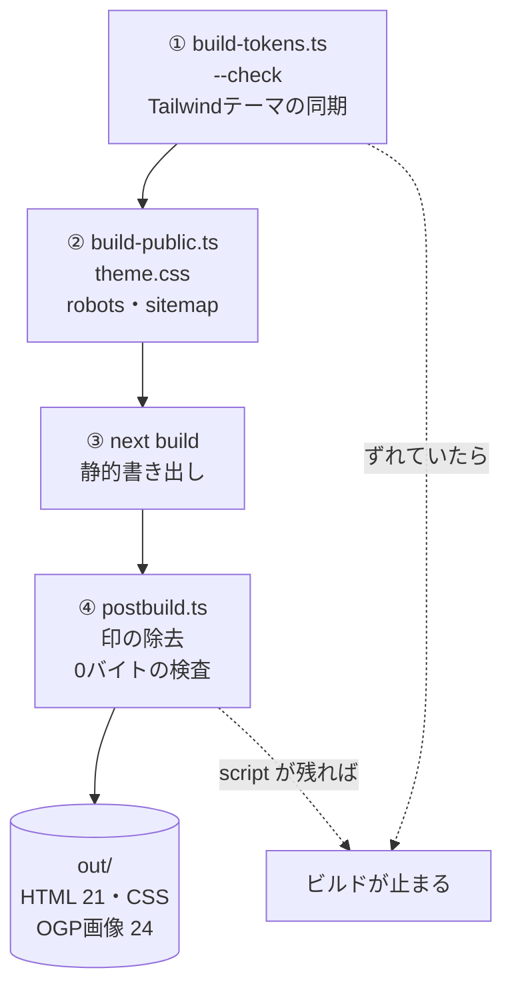
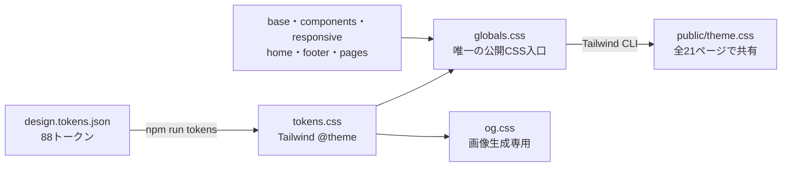
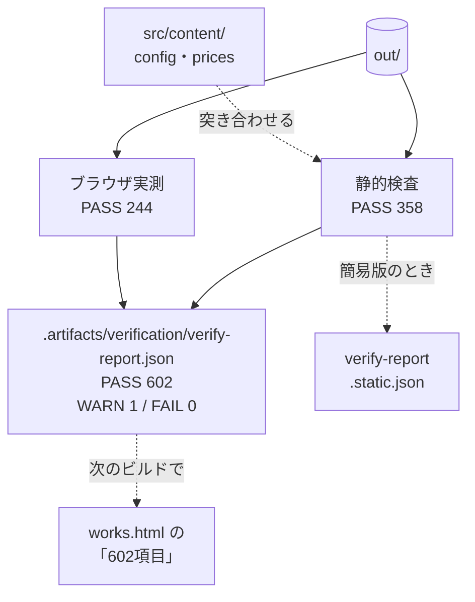
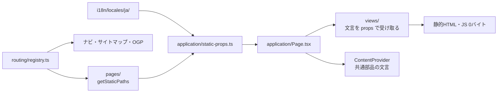

# 紬サイト ── Next.js + React + TypeScript

> 自社サイトの公開：2026-09-17 のオーナー指示により [ADR 0056](architecture/0056-owner-authorized-publication.md) を適用。専門家確認・受入確認の未実施分は WARN に残す。顧客テンプレートでは `OWNER_PUBLICATION=null` に戻し、従来の納品条件を適用する。紬は Vercel URL・メール受付で公開し、独自ドメインやフォームの導入を前提にしない。

サービスサイト本体。21ページ、**実行時 JavaScript 0バイト**。
ここには**コードを触るときの決まり**だけを書く。引き継ぎの入口は [AGENTS.md](../AGENTS.md)、いまの状態と残課題は [docs/status.md](status.md)。理由や経緯は [docs/](README.md)（技術の判断は [docs/architecture/](architecture/README.md)）。全体の図は [リポジトリ直下の README](../README.md)。

```bash
npm ci
npm run dev              # http://localhost:3000 （href="terms.html" のままのリンクも踏める）
npm run build            # トークン同期の検査 → public/ の生成 → next build → postbuild → out/
npm run verify           # 標準仕様の検査（ブラウザ実測を含む）。FAIL 0 で納品可。既定はプレビューモード
npm run verify -- --static   # 静的検査のみ（ブラウザ不要・CI向け。結果は .artifacts/verification/verify-report.static.json）
npm run verify -- --mode production  # 本番の公開条件で検査（VERCEL_ENV=production のときは指定しなくても本番）
npm run verify -- --write    # LCP実測値と記録日を src/content/measurements.ts に書き戻す（コミットしてから再ビルド）
npm run verify -- --dist <path>  # 検査するディレクトリを差し替える（既定は out/）
npm run tokens           # src/styles/design.tokens.json → src/styles/tokens.css（--check で同期検査）
npm run og               # OGP画像とファビコン（文面を変えたときだけ。差分をコミットする）
npm run og:check         # 一時ディレクトリに生成し public/og/ とバイト比較（macOS の正本環境で。ADR 0047）
npm run check:live -- --url https://<ドメイン>   # 公開後の確認（--dist out で公開前のリハーサル。ADR 0044）
npm run monitor -- --url https://<ドメイン>      # 公開後の監視と同じ確認（ADR 0046）
npm run backup           # git bundle と目録を .artifacts/backup/ に作る（ADR 0045）
npm run backup:restore-test -- --backup <dir>    # 別ディレクトリへの復元・照合・ビルドと所要時間の記録
npm run check:security   # ビルド済み out/ の危険な HTML・SVG・公開ファイルを検査
npm run audit:security   # moderate 以上の既知の依存脆弱性で停止
npm run test:security-browser # Chromium で CSP の正常表示・攻撃遮断を検証
npm run check            # 型・依存方向・循環・文言とルート・未使用コードの検査
npm run check:unused     # Knipで未使用ファイル・export・型・依存関係を検査
npm run check:collections  # 記事・事例などの公開前チェックと入稿枠の報告（checkにも含む）
```

---

## ビルドの流れ（`npm run build`）

4段階を順に回し、**どこかで崩れていたらその場で止まる。**



| 段階 | やること | 止まる条件 |
|---|---|---|
| ① `build-tokens.ts --check` | `src/styles/design.tokens.json` と `src/styles/tokens.css` が一致するか | 手で `tokens.css` を直した・`npm run tokens` を忘れた |
| ② `build-public.ts` | `src/styles/globals.css` を Tailwind CLI で `public/theme.css` にコンパイルし、`robots.txt`・`sitemap.xml` を書く | CSSコンパイル失敗 |
| ③ `next build` | 21ページを `out/` に書き出す（型検査を含む） | 型エラー |
| ④ `postbuild.ts` | `data-next-head` などの印を消し、JSON-LD 以外の `<script>` と `<!-- -->` を数え、`out/_next/` を消す | 1件でもあれば |

### CSS の中央管理（Tailwind CSS 4.3.3）



- 色・書体・寸法は `src/styles/design.tokens.json` が正本。`npm run tokens` で `@theme` を生成する。`tokens.css`・`public/theme.css` は手で編集しない。
- 共通部品の見た目は `src/styles/` の意味を持つクラスに `@apply` で定義する。ページのJSXにはクラス名を渡す。`source(none)` により、ページ内の文字列から偶然ユーティリティを生成しない。
- 各CSSは `globals.css` からだけ読む。`theme → base → components → screens → overrides → utilities` の順。既存のリセットを維持し、Preflightを追加しない。
- カード幅など役割のある寸法は `w-container`、色は `text-ink`、書体は `font-brand` などテーマのユーティリティを使う。用途固有の値は `src/styles/` 内の任意値で指定できる。
- グラデーション・キーフレーム・複雑な状態セレクターなどは同じCSS内に置く。SVGの座標・図形属性は図解データに残し、意味を持つ色は共通CSS変数で供給する。
- JSXの `style` は比較バーの比率・表の指定幅というデータを渡すCSS変数だけ。静的なスタイル、CSS Modules、`<style>` の持ち込みは `npm run check` が止める。
- `npm run dev` はテーマ生成・Tailwind監視・Nextをまとめて起動／終了する。JSONとCSSの変更は自動コンパイルされ、CSSはブラウザの再読み込みで反映する。単独実行は `npm run styles` / `npm run styles:watch`。
- `src/styles/og.css` も同じテーマとTailwindで画像生成時にコンパイルする。通常のページには配らない。字形の正本が未確定のため、OGPの変更検証は `npm run og -- --out <一時ディレクトリ>` で行い、既存PNGを不用意に上書きしない。

設計の理由と移行時の確認は [ADR 0009](architecture/0009-global-tailwind.md) を参照。

---

## 検査の流れ（`npm run verify`）



- **静的検査**：電話番号・JSON-LD・実行時JSなし・内部リンク・CSS変数・価格・トークンの同期・OGP画像など。**ブラウザ実測**：LCP・横スクロール・タップ領域・コントラスト・図の色・コンソールエラー
- **1件でも FAIL があれば終了コード 1**（納品しない）。項目の一覧は [docs/spec.md](spec.md)
- ページに出す件数は、ビルドした時点の `.artifacts/verification/verify-report.json` のうち、**全項目・FAIL 0・ビルドと同じコミット・未コミットの変更なし**のものだけから取る。それ以外は「—」（未計測）。数字を出すなら、変更をコミットしてから `npm run build && npm run verify && npm run build`（[ADR 0025](architecture/0025-verified-build-report.md)）
- レポートには測定日時・対象コミット（`GITHUB_SHA` → `VERCEL_GIT_COMMIT_SHA` → `git rev-parse HEAD`）と未コミットの変更の有無・成果物の指紋・種別とモード・件数・仕様20項目の受入状況が入る。画像の無いページの画像検査などは「対象なし（N/A）」として PASS に数えない
- 簡易版（`--static`）の結果は別のファイルに書き、ページの件数には使わない
- **プレビューと本番**：既定のプレビューは仮の設定でも通し、本番の不足を WARN 1 件にまとめる。本番モードは仮の値・空の `FORM_ENDPOINT`・承認記録や人の確認記録の不足を条件ごとに FAIL にする（[ADR 0024](architecture/0024-publication-gates.md)）
- **仕様20項目との対応**：自動検査・人の確認・対象外の条件の対応表は `tools/verify/acceptance.ts`、人の確認の記録は `src/content/acceptance.ts`。対応漏れや、ページに出す確認の方法との食い違いは FAIL（[ADR 0026](architecture/0026-acceptance-mapping.md)）

---

## Pages Router で書く（App Router にしない）

App Router は静的書き出しでも全ページに約173KB（gzip）の JS が載り、「実行時JS 0バイト」が崩れる。
測った結果と、`unstable_` を使うリスクの囲い方は [ADR 0001](architecture/0001-pages-router.md)。

- Next.js を上げるときは `npm run build && npm run verify` が通ることを確かめてから。通らなければ上げない
- 開発サーバー（`npm run dev`）の HTML には、ホットリロード用の script が入る。**0バイトの対象は `out/`（納品物）**

---

## 編集する場所と書き方

| 変更 | 正本 |
|---|---|
| 本文・見出し・SEO・共通文言・図のラベル | `src/i18n/locales/ja/`。ページ名・用途別の名前空間 |
| OGP画像の文面 | `src/i18n/locales/ja/og.ts`。金額は `content/og.ts` が価格データから差し込む |
| 連絡先・プロフィール | `src/i18n/locales/ja/config.ts`。電話番号・メール・郵便番号もここから `content/config.ts` に渡す |
| ドメイン・送信先・公開前設定 | `src/content/config.ts` |
| 契約・法務表示の承認記録、ソースコードの公開先 | `src/content/config.ts` の `LEGAL_APPROVALS`・`SOURCE_REPOSITORY_URL`。承認の値は確認を受けた人が記録する |
| 仕様20項目の人の確認・外部接続の記録 | `src/content/acceptance.ts`（検査との対応表は `tools/verify/acceptance.ts`） |
| 金額・計算 | `src/content/prices.ts`。BUILD・RUNは安定したキーで引く |
| 実測値 | `src/content/measurements.ts`。`verify --write` が数値と記録日を更新する（ビルドごとの再測定ではないので、ページには記録日を添える） |
| ページ追加・URL・アイコン・ナビ分類 | `src/routing/registry.ts` |
| ページの構造 | `src/views/`。`PageProps<'home'>` など、当該ページ用の文言だけを描画する |
| 暫定ヒーロー画像 | `src/assets/hero/onokoro.webp`。`build-public.ts` が `public/images/onokoro-hero.svg` に内包。コピーと代替説明は `i18n/locales/ja/home.ts` の `hero`。背景画に文字は含めず、コピーはHTMLで表示する（[ADR 0019](architecture/0019-complete-i18n.md)） |
| 静的生成の入口 | `src/pages/index.tsx`・`404.tsx`・`[page].tsx`。全入口に `unstable_runtimeJS: false` |
| props の用意とテンプレート選択 | `src/application/`。ファイルシステムは `getStaticProps` からだけ読む |
| 共通表示 | `src/layouts/`・`src/components/`。文言は `ContentProvider` で配布 |
| SVG の座標・色・図形 | `src/components/diagrams/` の型付き React / SVG。共通の枠とレスポンシブ切替は `Figure.tsx`、文字は `diagrams` カタログから props / Context 経由で受け取る（ADR 0023） |
| CSS | `src/styles/`。トークンは `design.tokens.json` が正本 |
| 配布ファイル | `out/`。手で編集しない |
| 問い合わせの受付・通知・保持期限（サーバー側） | `services/inquiry/`。フォームの項目名・上限・担当者・保持期間は `src/content/inquiry.ts`、営業日は `src/content/business-calendar.ts`、結果画面と通知の文言は `i18n/locales/ja/inquiry.ts`（ADR 0032〜0034） |

`pages → application → views → layouts → components → content → i18n → routing → lib`

右側から左側への import と循環は禁止。`src/` の import は `@/` を使う。ビルド・検査ツールは content・i18n・routing・lib を利用できる。



- 文言のキーは並べ替えや修正で改番しない。文言の変更はカタログで行う。
- 値を含む文は `format(copy.heading, { amount, months })`。差し込み名は型検査される。文字列を分割して並べると React の区切りコメントが出るため、1つの文に組み立てる。
- 本文中のリンクは `@route:terms` などの識別子。コードからは `href('terms')` を使う。深い404からも辿れる `/terms.html` に解決する。
- 電話リンクは `<PhoneLink className="btn btn-1" />`。表示番号と発信先を別々に書かない。
- `<strong>` 入りの信頼済み本文だけを `raw()` に渡す。外部入力は対象外。
- `next/link` のクライアント遷移は使わず、通常のリンクで移動する。
- 現在は日本語のみ・1ビルド1言語。未対応言語はエラーにする。追加時の条件は [ADR 0004](architecture/0004-content-and-routing.md) に記載。

### ページを追加するとき

1. `routing/registry.ts` に ID・アイコン・ナビの分類を追加する。
2. 日本語カタログと `views/` のテンプレートを作り、`application/Page.tsx` の分岐に登録する。
3. `og.ts` の文言を追加し、定めた書体環境で共有カードを用意する。
4. `npm run validate` と `npm run verify` を通す。URLとOGPの登録漏れ、文字の直接記述、循環、JS混入は検査で止まる。

ルート・文言・レイアウトを別々に追える構成にした理由と互換性の条件は [ADR 0004](architecture/0004-content-and-routing.md)。

### 記事・事例・対応エリア・顧客事例を足すとき（顧客サイト）

固定の登録表には足さない。文書を足すと、公開したものだけが一覧（`/<base>.html`）と詳細（`/<base>/<slug>.html`）になる。

| 変更 | 正本 |
|---|---|
| 記事・事例・対応エリア・顧客事例の文書 | `src/i18n/locales/ja/entries/`（articles・cases・areas・works） |
| 一覧と詳細の共通文言（見出し・絞り込み・未計測など） | `src/i18n/locales/ja/collections.ts` |
| URL の土台・既存ページへの添付・代替の共有カード | `src/content/collections.ts` の `COLLECTION_SETTINGS` |
| 項目の型・公開前チェック | `src/lib/collections/`（案件で変えない） |

1. 文書を `status: 'draft'` で足し、`npm run check:collections` で足りない項目を確かめる。
2. 埋めたら `status: 'published'` にする。不足があると `npm run check` とビルドが止まる。
3. `npm run build` で sitemap・ナビ・共有カードまで反映される。公開 0 件のコレクションはページを作らない。

事例の絞り込みは JavaScript を使わない CSS 方式で、3 ファセット × 各 12 値まで（[ADR 0041](architecture/0041-css-case-filter.md)）。設計は [ADR 0040](architecture/0040-collections.md)、対応エリアの公開条件は [ADR 0042](architecture/0042-service-area-pages.md)、顧客事例の測定値と掲載許可は [ADR 0043](architecture/0043-client-work-records.md)。

## 開発ライブラリと実行環境

Node.js 24 系を使います（`.nvmrc` と `package.json` の `engines`、CI、Vercel で共通）。
初回は `nvm install && nvm use`、`npm install --global npm@12.0.2`、続けて `npm ci` を実行してください。npm 12.0.2 は `packageManager`・CI・Vercel のインストール指定で統一しています。

| 用途 | ライブラリ／コマンド |
|---|---|
| コンパイルと型検査 | TypeScript 7.0.2（`@typescript/native` の `tsc`） |
| 検査ツール用の互換 API | `typescript` は `@typescript/typescript6` 6.0.3 の npm alias |
| React のアイコン | `lucide-react`。SVG はビルド時に描画 |
| 条件付きの CSS クラス | `clsx` |
| 外部データの構造検証 | `zod`。実測レポートの値を検証 |
| コード検査 | ESLint 9 の最新互換版 + `eslint-config-next`。`npm run lint` |
| 未使用コード | Knip。設定は `config/knip.config.ts`。`npm run check:unused`（checkにも含む） |
| 単体テスト | Vitest。`npm test`／`npm run test:watch` |
| ブラウザ実測 | Playwright。`npm run verify` |
| 整形 | Prettier。`npm run format`／`npm run format:check`（既存ファイルの一括整形は任意） |
| 配備 | Vercel CLI。`npm run deploy:preview`／`npm run deploy:production` |

`npm run validate` は型・依存方向・lint・単体テスト・ビルド・静的検査をまとめて実行します。
CI は追加で Chromium の実測検査も行います。テストや設定ファイルも TypeScript で管理します。
Vercel は リポジトリルートを Root Directory に設定し、`vercel.json` で `out/` だけを配信します。

ESLint 10 は Next.js が使う React/import/a11y プラグインのサポート範囲外のため、9.39.5 を使います。
TypeScript 7 の CLI と互換 API の併用理由、依存の overrides は [ADR 0003](architecture/0003-modern-stack.md) を参照してください。


## ディレクトリの境界

すべてのコマンドはルートで実行する。`src/` にアプリ、`src/styles/` に中央管理したTailwind、`src/assets/` に公開前の元画像を置く。`public/` はそのまま配信する素材。`tools/scripts/` は開発・生成・構造検査、`tools/verify/` は納品物の検査、`tools/pricing/` は独立した事業モデル。`tools/ops/` は見積もり・指標・月次レポート・修正依頼・顧客管理・営業リスト・GBP の社内 CLI（`npm run ops:*`、使い方は [tools/ops/README.md](../tools/ops/README.md)）と、公開後の確認・監視・バックアップ（`npm run check:live`・`monitor`・`backup`）で、実データは git 管理外の `.data/` に置く（[ADR 0036](architecture/0036-internal-ops-tools-and-estimates.md)）。公開サイトからは読み込まない。`services/` は静的サイトとは別に配備するサーバー処理（問い合わせの受付）で、`@/content`・`@/i18n`・`@/routing`・`@/lib` だけを使い、`src/` と `tools/` からは import しない。リポジトリ直下に `api/` を作らない（Vercel が関数として自動で配備するため。ADR 0032）。

ESLint・Vitest・Prettierの補助設定は `config/`、Next.js・TypeScript・npm・Vercelの探索起点となる設定はルートに残す。`@/` は引き続き `src/` を指す。検査レポートとスクリーンショットは `.artifacts/` に置き、Gitに含めない。

`npm run validate` は価格モデル 10 件も検査する。モデル本体・レポート・テストは TypeScript で、`npm run check` の型検査・未使用検査と lint の対象。再計算は `npm run --silent report:pricing`。Vercel の Root Directory と GitHub Actions・Dependabotはすべてルート基準。旧 `site/` を再作成しない。

手書きコードは `.ts` / `.tsx` を使う。`allowJs: false` だけでは JavaScript の追加を防げないため、ルートの設定ファイルと `src/`・`tools/`・`services/`・`config/`・`tests/` 内への `.js`・`.mjs`・`.cjs`・`.jsx` の追加を構造検査で拒否する。`public/`・`out/` 等の生成物と依存パッケージ内部はこのソース検査の対象外で、公開ページへの実行時 JavaScript 混入は別途 postbuild と verify で検査する。


### 和文・英数字の半角スペース

表示文言はカタログを解決するときと `i18n/format.ts` の変数差し込み時に整える。`制作{price}円` は `制作 79,800 円` になる。本文・表・図解・案内属性・OGPに共通適用する。値と単位を別の要素で出す場合は、単位のi18n文言に半角スペースを含める。Statsのように一つの文字列に組み立てる場合は共通の `japaneseSpacing` を通す。URLやコードへスペースを挿入しない。

HTML文言は `i18n/html-typography.ts` がparse5でテキストと案内属性だけを扱う。全HTMLの単純置換や、SSR後だけの整形はしない。`postbuild` と全ページ描画テストが未適用の文字列を検出する。共有画像の文言変更時は `npm run og` でも同じ規則が適用される（[ADR 0021](architecture/0021-pricing-and-typesetting.md)）。

### 店舗テンプレートの設定

店舗・スタッフ・お客様の声は `src/content/store.ts`・`staff.ts`・`testimonials.ts`、連絡窓口の優先順は `contact-actions.ts` が入口。公開条件の検証を通し、表示文は既存 i18n カタログから参照する。未設定の店舗欄・声は表示しない。構成・部品の採用理由・検証結果・未確認事項は [ADR 0048](architecture/0048-storefront-template.md) を参照。
