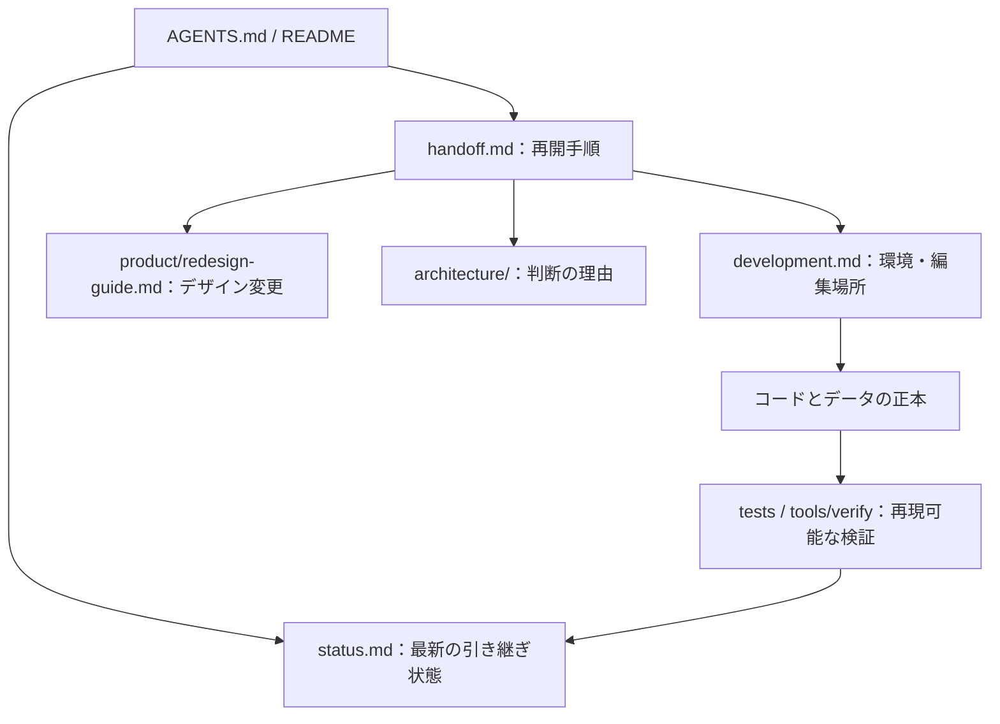

# 人と AI の開発引き継ぎ

最初に [AGENTS.md](../AGENTS.md)、次に [現在の状態](status.md) を読む。ここは環境を問わず再開するための手順書であり、最新のブランチ・件数・公開状態は `status.md` に集約する。会話履歴や個人のメモリを前提にしない。

## 1. 正しい作業場所を確かめる

```bash
git rev-parse --show-toplevel
git status --short
git branch --show-current
git remote -v
git log -5 --oneline
```

対象は GitHub `bright-broom/tsumugi`。この作業で使用した checkout は `/Users/toshikisakuta/dev/tsumugi-wt/store` だが、他の端末ではリポジトリルートからの相対パスを使う。この端末には別の checkout `/Users/toshikisakuta/dev/tsumugi` と ChatGPT のプロジェクトミラーも存在するため、フォルダ名だけで作業対象を決めない。ミラーの `sources/` は同期資料であり編集しない。

未コミットの変更を確認してから作業する。他の人・AI の差分を reset / clean / 上書きで消さない。ブランチ名は過去の記録を盲目的に使わず、実際の状態を確認する。

必要なリモート状態は読み取りで更新する。

```bash
git fetch origin
git log --oneline HEAD..origin/main
git diff --stat HEAD origin/main
gh pr list --state all --head "$(git branch --show-current)" --json number,url,state,baseRefName,headRefName
```

GitHub CLI の認証がない場合は GitHub の画面や利用可能な接続で確認し、取得できない状態を「未確認」と記録する。fetch はリモート追跡情報の更新であり、現在の作業ファイルを main に揃える操作ではない。

再開時はまずstatusの「再開ポイント」を読み、検証対象SHA・PRのhead・main・本番を別々に確認する。履歴の「未完了」「未採用」は当時の状態であり、新しい記録より優先しない。

## 2. 正本を選んでから編集する



| 情報                       | 正本・入口                                                                                                                                | 引き継ぎ時の注意                                                                                                 |
| -------------------------- | ----------------------------------------------------------------------------------------------------------------------------------------- | ---------------------------------------------------------------------------------------------------------------- |
| 現行料金・受付状態・計算   | `src/content/prices.ts`                                                                                                                   | 金額を JSX・CSS・翻訳文に重複記述しない                                                                          |
| 料金改定と資料同期 | [料金の引き継ぎ](business/pricing-maintenance.md)・[採用料金](business/pricing-2026-09-18.md) | 旧案と現行を区別。Excel再計算と適用条件もここを読む |
| 上位商品の検討案           | [新料金表](business/pricing-2026-09-18.md)、`PROPOSED_PRICES`（旧商品設計は履歴）                                                                       | 検討価格と販売商品を分離。検討中のプランへ申込動作を追加しない                                                   |
| 料金の Excel               | `docs/business/紬_全プラン比較・料金試算.xlsx`                                                                                            | 比較・試算用の写し。Excel の編集だけではサイトは変わらない。社内採算があるためサイトから公開ダウンロードさせない |
| 文言                       | `src/i18n/locales/ja/`                                                                                                                    | `ContentProvider` / props 経由で渡す。日英数字間の空白は既存の typography 処理を使う                             |
| 電話・メール・住所・担当者 | `src/content/config.ts` と参照する日本語カタログ                                                                                          | 表示・リンク・JSON-LD の一貫性を保つ。実在する資格や経歴を推測で足さない                                         |
| ルート                     | `src/routing/registry.ts`                                                                                                                 | `.html` URL、内部リンク、ナビ、OGP、サイトマップを揃える                                                         |
| ページ生成                 | `src/pages/` → `src/application/` → `src/views/`                                                                                          | Pages Router と静的出力を維持                                                                                    |
| 共通 UI                    | `src/layouts/`、`src/components/`                                                                                                         | `Section / Cards / Acc / Figure / PageIndex`、`ActionLink / ActionButton / PhoneLink` を利用                     |
| デザイン                   | [リデザイン手順](product/redesign-guide.md)、`src/styles/design.tokens.json`                                                              | 配色・文字・寸法は中央管理。共通部品 CSS は `styles/components/`。ページ固有 CSS とカスケードを確認              |
| ビルド・検査               | `package.json`、`tools/scripts/`、`tools/verify/`、`tests/`                                                                               | バージョンの正本は package と lockfile。検査を弱めて合格扱いにしない                                             |
| セキュリティ・公開         | [運用](operations.md)、[ADR 0055](architecture/0055-security-hardening.md)、[ADR 0056](architecture/0056-owner-authorized-publication.md) | 自社公開と顧客納品の条件を区別                                                                                   |
| 顧客用の受付サービス       | `services/inquiry/`、[問い合わせデータ](inquiry-data.md)                                                                                  | コード・モックテストの存在は実配備・実送信の完了を意味しない                                                     |
| 社内ツール                 | `tools/ops/README.md`                                                                                                                     | `.data/` の顧客実データ・認証情報をコミットしない                                                                |

詳しい依存方向と編集規則は [開発手順](development.md)。判断を変える場合は既存 ADR を消さず、新しい ADR に理由を記録する。

## 3. ユーザーが決めた方針を保つ

- 公開ページの実行時 JavaScript は 0。React / TypeScript はビルドで使い、通常リンクとブラウザ標準の開閉で動かす。App Router や UI ライブラリへ移行するためだけに、この条件を崩さない。
- デザインは今後大きく変更する可能性がある。色・文字・余白は共通トークン、ボタンは共通 Action を使う。アイコンと図解を活かし、ページ本文と価格の意味を保つ。
- 制作のみ・保守契約なしを選べる。任意の保守や外部契約の費用を制作価格へ無条件に足さず、必要な費用と条件は明示する。現行金額はコードを参照する。
- 自社の問い合わせはメールと電話。メールフォームを開くことを必須にしない。土日も対応し、電話とメールの受付時間は共通カタログの値を使う。
- アイコンで意味が伝わる連絡先の冗長なラベルを再追加しない。番号やアドレス、読み上げに必要な情報は保持する。
- ヒーローのコピーは画面幅に合わせて画像内に収める。図解・画像の上端・狭い幅の表示は [ADR 0061](architecture/0061-responsive-hero-canvas.md) と検証を参照する。
- 競合比較を有利に見せるために不利な条件や必要費用を隠さない。他社固有名の掲載方針は [表現と価格](product/messaging-and-pricing.md) を参照する。
- リポジトリの公開範囲はオーナーが決める。2026-09-18確認時はPrivate。過去のPublic承認だけで可視性を変更しない。認証情報・顧客実データの公開承認とは解釈しない。

## 4. 環境と検証を再現する

Node / npm / Playwright のセットアップは [AGENTS.md のコマンド](../AGENTS.md#4-コマンドと合格ライン)。ローカルは `npm run dev -- --port 3001`、従来の確認先は `/plans.html`。ポートやプロセスの稼働は会話中の URL から推測しない。

アプリケーションを変更したら以下を実行する。

```bash
npm run validate
npm run verify -- --mode production
```

`validate` は型・lint・単体・料金テスト・ビルド・セキュリティ・静的検査。ブラウザを含む本番モード検査は別に実行する。見た目を維持する変更では [変更前後の比較](product/redesign-guide.md#全ページの変更前後を比べる) も行う。大幅な変更では意図した差分を閲覧し、料金・受付状態・操作・アクセシビリティを別に確認する。

ローカルの `.artifacts/` は Git 管理外。他の AI・端末に同じ証跡があるとは限らない。直近のコミット・結果は `status.md` と ADR、証跡がなければ上記コマンドで再生成する。変更前の出力がない場合は、対象 ADR の変更前コミットから別 worktree を用意してビルドし、変更後の出力と同じブラウザで比較する。ビルド済みの `out/`、`public/theme.css`、生成 `tokens.css` を手編集して合わせない。

### works.html の検証結果表示

表示用の検証記録は、クリーンな作業状態・同じコミット・全項目・不合格 0 が必要。別コミットの古いレポートをコピーして数字を埋めない。

```bash
# 実装・文書をコミットした後に実行
npm run build
npm run verify -- --mode production
npm run build
```

文書だけを変更した場合は、相対リンク・記載するパスとコマンド・変更対象が文書だけであること・差分の整形を確認する。アプリの既存検証結果は、その対象コミットを明記して引用し、新コミットで再実行したと記録しない。公開用の出力を作り直す場合は上記の検証順序に従う。

## 5. 実装・送信・公開を分けて報告する

| 状態             | 完了と言える根拠                                                                   |
| ---------------- | ---------------------------------------------------------------------------------- |
| ローカル実装     | 対象コミット、差分、該当する検証結果                                               |
| GitHub への push | push 成功、`git ls-remote` の SHA と送信コミットの一致                             |
| main への反映    | PR の MERGED と merge commit。ブランチへの push だけでは判断しない                 |
| CI 合格          | 対象コミットに紐付くチェック結果                                                   |
| Vercel 配備      | 対象 deployment とチェック結果。PR プレビューと production alias を区別            |
| 本番 URL の更新  | production alias が対象 deployment を向き、公開 URL で対象ページ・内容・動作を確認。内容の一致は main 後の Release check（ADR 0076）の成功、または同じツリーの `out/` での `check:release` 全件一致を根拠にする |

本番モードのローカル検査は公開操作ではない。認証が必要で確認できない場合は、どこまで確認し、何が未確認かを書き残す。

## 6. 作業終了時の記録

1. `docs/status.md` に目的、変更範囲、対象コミットまたはブランチ、実行した検査、未確認事項、次の一手を書く。
2. 判断理由は `docs/architecture/`、編集・検証方法は `docs/development.md` または `docs/product/redesign-guide.md` へ。入口の `AGENTS.md` / `docs/README.md` から参照できるようにする。
3. コード・ローカル・CI・GitHub・本番を分け、日時と根拠を付ける。古い記録を消さず、現在の残課題と履歴を分ける。
4. 出力画像・ログ・実データの保存場所と Git 管理の有無を記録する。資料は外部の個人フォルダや AI の会話にだけ残さない。
5. 通常の文章変更のために新しい承認手続きを作らない。既存のユーザー承認の範囲と、外部作業が必要な未確認事項を区別する。

Claude Code の入口は `CLAUDE.md` が共通の `AGENTS.md` を参照する。ほかの AI でも同じファイルを読める。自動読込の可否は製品・設定によるため、自動で読む機能がない場合は README の「AI・開発者の引き継ぎ」から開始する。
