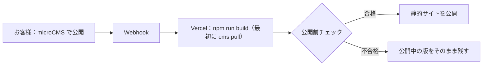

# 更新管理画面（microCMS）の設定と操作説明

「情報を育てる」プランの記事・事例を、お客様が管理画面から追加・更新するための手順。判断の理由は [ADR 0080](../architecture/0080-microcms-content-source.md)。公開サイトは静的なまま（実行時 JavaScript 0）で、更新のたびに作り直して公開する。

## しくみ

- 取り込むのは **公開済み** の記事・事例だけ。下書きはサイトに出ない。
- 画像はビルドのときにサイトへ取り込む（WebP・最大幅 1600px）。CMS を解約しても、取り込み済みの画像とスナップショット（`src/i18n/locales/ja/entries/cms.json`）をコミットしておけば同じサイトを作り直せる。
- 公開前チェックに通らない内容（説明文の長さ、画像の代替テキスト、分類にない業種など）があると、そのビルドは止まり、公開中の版は変わらない。

## 制作側の設定（1 社ごと）

1. お客様名義で microCMS のサービスを作る（料金プランは契約前に公式ページで確認し、見積に記載する）。
2. 下の表のとおり API を 2 つ作る（どちらも「リスト形式」）。
3. 読み取り専用の API キーを作る（GET だけ）。
4. Vercel の環境変数に `CMS_SOURCE=microcms`、`MICROCMS_SERVICE_DOMAIN=<サービス ID>`、`MICROCMS_API_KEY=<API キー>` を入れる。キーをリポジトリに書かない。
5. Vercel の Deploy Hook を作り、microCMS の Webhook（コンテンツの公開・更新・削除）に登録する。
6. 手元で `npm run cms:pull` を実行し、初期登録 3 件がチェックを通ることを確かめてから、スナップショットと画像をコミットする。

### API「articles」（お知らせ・コラム）

| フィールド ID    | 種類            | 必須 | 内容                                                 |
| ---------------- | --------------- | ---- | ---------------------------------------------------- |
| `slug`           | テキスト        | ○    | URL になる英小文字・数字・ハイフン（例 `open-2026`） |
| `kind`           | セレクト（1つ） | ○    | `news`（お知らせ）か `column`（コラム）              |
| `title`          | テキスト        | ○    | 50 文字まで                                          |
| `date`           | 日時            |      | 掲載日。空なら公開日                                 |
| `seoTitle`       | テキスト        |      | 検索結果の題。空なら `title`                         |
| `seoDescription` | テキストエリア  | ○    | 40〜160 文字                                         |
| `image`          | 画像            |      | 一覧・冒頭の画像                                     |
| `imageAlt`       | テキスト        |      | 画像を説明する文（画像があれば必須）                 |
| `order`          | 数字            |      | 並び順を固定したいときだけ                           |
| `body`           | 繰り返し        | ○    | 下のカスタムフィールドを並べる                       |

本文 `body` のカスタムフィールド（HTML のリッチエディタは使わない）：

| カスタムフィールド ID | 項目                                                            |
| --------------------- | --------------------------------------------------------------- |
| `paragraph`           | `text`（テキストエリア）                                        |
| `heading`             | `text`（テキスト）                                              |
| `list`                | `items`（テキストエリア。1 行が 1 項目）                        |
| `image`               | `image`（画像）・`alt`（テキスト）・`caption`（テキスト、任意） |

### API「cases」（施工事例など）

`articles` の `kind` 以外の項目に加えて：

| フィールド ID | 種類             | 必須 | 内容                                                                    |
| ------------- | ---------------- | ---- | ----------------------------------------------------------------------- |
| `industry`    | テキスト         | ○    | 業種の ID（リポジトリの `entries/cases.ts` の分類）                     |
| `categories`  | セレクト（複数） | ○    | 分類の ID。選択肢は分類と同じ ID にする                                 |
| `area`        | セレクト（1つ）  |      | 地域の ID                                                               |
| `summary`     | テキストエリア   | ○    | 一覧に出す概要                                                          |
| `fields`      | 繰り返し         |      | カスタムフィールド `field`：`key`（詳細項目の ID）・`value`（テキスト） |
| `gallery`     | 繰り返し         |      | カスタムフィールド `photo`：`image`・`alt`                              |

業種・分類・地域の定義はリポジトリで管理する（CMS で自由に増やすと、絞り込みと表示の検査が効かないため）。増やすときは制作側に依頼する。

## お客様向けの操作説明

1. microCMS にログインし、「お知らせ・コラム」または「施工事例」を開く。
2. 「追加」から、題・URL 用の名前（英小文字）・説明文（40〜160 文字）を入れる。
3. 本文は「段落」「見出し」「箇条書き」「画像」を必要な順に足す。画像には、見えない方にも伝わる説明文を必ず入れる。
4. 「公開」を押すと、数分でサイトに反映される。反映されない場合は、入力に足りないところがある可能性があるため、担当者に連絡する（サイトは前の状態のまま表示される）。
5. 公開をやめる場合は「公開終了」にする。サイトからも数分で消える。

電話番号・料金・営業時間などサイト全体に関わる情報は、この画面では変えられない（誤って消えないよう、制作側で管理する）。

## 残る条件

- 下書きのプレビュー画面はない（静的サイトのため）。公開前に確かめたい場合は、制作側の確認環境で `cms:pull` と `npm run build` を行う。
- 取り込みは API キーで公開済みだけを読む。書き込み（CMS への復元）は実装していない。CMS へ戻す場合はスナップショットから入力し直すか、microCMS の機能で取り込む。
- 実際の microCMS のサービス・Webhook・Deploy Hook では試していない。最初の顧客の導入時に、架空の記事で公開・更新・削除・失敗時の保持を確かめてから受付を開始する。
