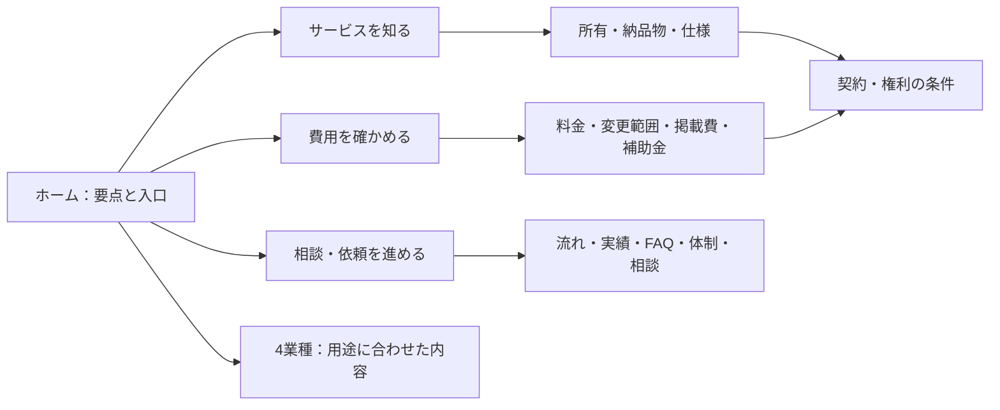
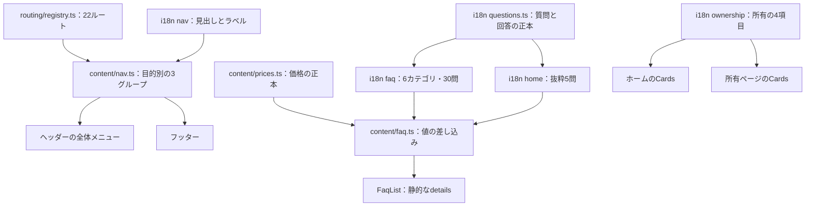

# ページの役割と情報の正本

22ページを「知る → 費用を確かめる → 相談へ進む」の順で案内する。同じ説明を使うときは文言を共有し、詳細な条件は、その判断をするページに残す。

## 全ページの役割

| ページ       | ここで答えること                           | 共通化／この場に残す情報                                                               |
| ------------ | ------------------------------------------ | -------------------------------------------------------------------------------------- |
| `index`      | 何が違い、自分に合うか                     | 所有の4項目とFAQ5問を共有。図解・料金の要点・不利な比較も保持し、詳細へ案内            |
| `owned`      | 自分のものになるとは何か                   | 4項目はホームと同じ定義。引き継ぎ・移転の図解と手順、契約前の6つの確認は詳細として保持 |
| `source`     | 具体的に何を受け取るか                     | 納品ファイルと受け取り方法を説明する正本。所有の概念だけに縮めない                     |
| `spec`       | 品質をどう確かめるか                       | 20項目の仕様・対象外・実測を保持。FAQの短い回答から参照                                |
| `plans`      | どのプランが目的に合うか | 制作・月額・追加オプションを比較。現行・準備中・検討中の状態を各価格の近くに表示。社内採算は掲載しない |
| `price`      | 制作・任意支援・外部費を合計するといくらか | 価格値は `content/prices.ts`。範囲・比較前提・受付準備中・不利な条件を価格と一緒に保持 |
| `unlimited`  | どこまでの変更を頼めるか                   | 作業枠・超過時の選択・別見積もり・依頼手順の詳細を保持                                 |
| `cost-cut`   | 掲載費をどう見直すか                       | 試算・広告やポータルを残す判断・段階的な手順を保持                                     |
| `subsidy`    | どの条件で支援を使えるか                   | 不採択・立て替え・申請と契約の順序を、このページでも保持                               |
| `flow`       | 依頼から納品まで何をするか                 | 制作の10段階と工程固有の疑問を保持。補助金利用時の順序も省略しない                     |
| `works`      | どの実績を確認できるか                     | 自社サイト1件の実測と顧客事例が今後であることを区別。FAQも同じ事実に揃える             |
| `faq`        | 判断前の疑問を短く解決できるか             | 共通の30問を6カテゴリに分類。目次・質問の安定ID・各詳細へのリンクを用意                |
| `about`      | 誰がどう対応するか                         | 人員・対応体制・仕事の進め方を保持                                                     |
| `contact`    | 何を伝えて相談すればよいか                 | 最初に聞く3項目・連絡手段・フォームの仮設定を保持                                      |
| `restaurant` | 飲食店で何を載せるか                       | 共通の業種テンプレートを利用。メニュー・予約導線など固有の判断は保持                   |
| `koumuten`   | 工務店・建設で何を載せるか                 | 施工事例・問い合わせなどの固有情報を保持                                               |
| `salon`      | 美容室・サロンで何を載せるか               | 料金表・予約・掲載費などの固有情報を保持                                               |
| `shigyo`     | 士業・専門事務所で何を載せるか             | 料金・人柄・電話などの固有情報を保持                                                   |
| `terms`      | 契約・所有・解約の条件は何か               | 法務上の条件の正本。本文と弁護士確認前の注意を維持                                     |
| `privacy`    | 個人情報をどう扱うか                       | 利用目的・取り扱い・問い合わせ先を維持                                                 |
| `legal`      | 事業者・取引条件は何か                     | 法定表示の本文を維持                                                                   |
| `404`        | 存在しないURLからどう戻るか                | 復帰導線を維持                                                                         |

## 管理する単位

- 文言はi18n、金額は事業データ、URLはルート台帳、HTMLの構成は表示部品が担う。共通文言もページの入力に含めて渡す。
- FAQは意味のあるIDを持つ質問と完全な回答で管理する。価格は名前付き変数のまま保持し、表示時に現在値を差し込む。ホームに同じ回答のコピーを作らない。
- 同じアコーディオンでも、所有ページの「契約前の確認」とFAQの「疑問への回答」は役割が違うため統合しない。
- 料金の前提・権利の制限・補助金の注意は、読者がその場で判断するために繰り返す。省略するための共通化は行わない。
- 原稿作成のFAQは、入口プランの支給素材整理と追加取材の別見積もりを区別する。実績のFAQは、自社サイトと顧客事例を区別する。
- ホームだけにあった広告の回答はFAQにも掲載する。集客の回答は一般向けに統一し、従来ホームの美容業界固有の数値を外す。広告・SEO等の既存の主張を新たに実証した変更ではない。

技術判断・出力差分・検証は [ADR 0017](../architecture/0017-information-architecture.md) を参照。
