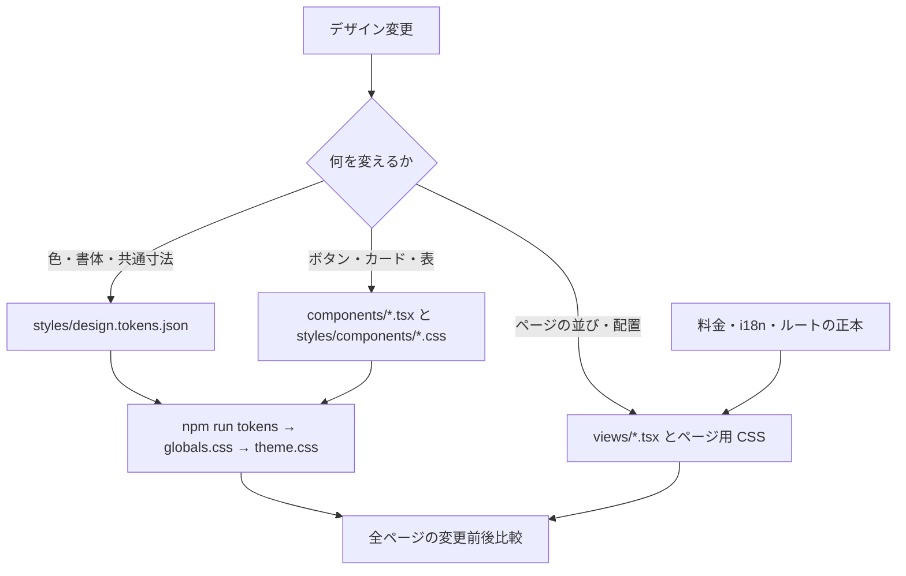

# デザインを変更するときの入口

このサイトは、料金・文章・URL を維持したまま、配色、書体、部品、ページ構成を段階的に変更する。公開ページへ設定パネルや JavaScript は追加しない。

## 変更の大きさで編集場所を選ぶ



| 変えたいもの             | 編集する正本                                                                     | 確認範囲                                                 |
| ------------------------ | -------------------------------------------------------------------------------- | -------------------------------------------------------- |
| メイン・サブ・アクセント | `src/styles/design.tokens.json` の `color.main / sub / accent`                   | 全ページ、図解、コントラスト、テーマ色。OGP は別途再生成 |
| 書体・本文・注記         | 同 JSON の `font.family / font.size / font.tracking / font.leading`              | 改行・価格の桁・日本語の長文・狭い画面                   |
| 読み幅・章の余白         | 同 JSON の `size`。下層の章間は `interior-section-*`、先頭の余白は `intro-*-*`   | TOP と下層を分けて確認                                   |
| 主要・副次ボタン         | `src/components/Action.tsx` と `src/styles/components/actions.css`               | リンク・電話・フォーム送信・無効状態                     |
| カード・表・開閉         | `styles/components/cards.css / tables.css / disclosure.css`                      | 他ページで同じ部品を使う場所も確認                       |
| ヘッダー                 | `components/Header.tsx`、`styles/components/header.css`、`styles/responsive.css` | 開閉・キーボード・狭い幅                                 |
| フッター                 | `components/Footer.tsx`、`styles/footer.css`                                     | 電話・メール・目的別案内                                 |
| TOP の構成・ヒーロー     | `views/index.tsx`、`styles/home.css`                                             | 絵の切り取りと文の重なり、リンク先                       |
| 下層全体                 | `components/Section.tsx`、`styles/interior.css`                                  | 全下層ページ・読み物・業種・料金                         |
| プラン一覧               | `views/catalog.tsx`、`styles/catalog.css`                                        | 受付状態・税込・総額・表・開閉                           |
| 文言だけ                 | `src/i18n/locales/ja/`                                                           | 見出し長・改行。CSS に文言を書かない                     |
| 料金・公開状態           | `src/content/prices.ts`                                                          | 料金テスト・全表示との整合。見た目の変更では触らない     |
| URL・ナビ                | `src/routing/registry.ts`、`src/content/nav.ts`                                  | 内部リンク・現在地・サイトマップ                         |

## 共通部品を使う

```tsx
<ActionLink variant="primary" href={href('contact')}>
  {copy.consult}
  <Icon name="arrow-right" sm />
</ActionLink>
<ActionLink variant="secondary" href="#details">{copy.details}</ActionLink>
<PhoneLink variant="secondary" />
<ActionButton type="submit" disabled={disabled}>{copy.submit}</ActionButton>
```

- `ActionLink` は通常の `<a>`。画面遷移・電話・ページ内リンクの動作を保つ。
- `ActionButton` は通常の `<button>`。省略時は `type="button"` なのでフォームを誤送信しない。送信する場合だけ `type="submit"`。
- `className` は `catalog-plan-cta` など配置の調整用。`btn btn-1` を各ページへ直接書かない。
- 共通の文字は `text-fine / text-compact / text-body / text-lead / text-h3`、角丸は `rounded-card / rounded-media`。同じ値の直接指定は `npm run check` で検出する。
- `Section` の `tone / wide / reading`、既存の `Cards / Acc / PageIndex / Figure` をまず使う。全部を同じ万能コンポーネントへ押し込めない。
- 画像内の座標・SVG の比率・ページ固有の価格文字サイズは用途固有の値を維持する。共通トークンの追加は複数の箇所に同じ役割があるときに限る。

## CSS の優先順位

```text
src/styles/globals.css       公開 CSS の入口（ここからのみ読み込む）
  tokens.css                JSON から生成。手編集しない
  base.css                  リセット・書体・基本要素
  components.css            部品 CSS の import 順序だけを管理
    components/*.css        役割ごとの共通部品
  responsive.css            既存の共通レスポンシブ規則
  home.css / footer.css     TOP・フッター
  pages.css / collections.css / interior.css / catalog.css
```

`theme → base → components → screens → overrides → utilities` の順を維持する。今回、既存のカスケード順は変更していない。`interior.css` には下層の共通部品調整があるため、共通部品を変えるときは同じセレクターを検索する。ページの例外を共通側へ逆流させず、既存の該当ルールを編集する。後から同じセレクターを末尾に足して上書きを積み重ねない。

テーマの参照はビルド時に解決する。ブラウザで `--color-main` だけを書き換える方式ではない。JSON を変更し `npm run tokens` とビルドで全参照を更新する。`npm run dev` では自動生成する。

## 全ページの変更前後を比べる

作業前に、同じ環境でビルドして変更前の出力を保存する。

```bash
npm run build
mkdir -p .artifacts/design
cp -R out .artifacts/design/before-2026-09-17
# 実装・トークンの再生成・ビルド
npm run tokens
npm run validate
npm run design:compare -- .artifacts/design/before-2026-09-17 out .artifacts/design/review-2026-09-17
npm run verify -- --mode production
```

比較は全 HTML を自動列挙し、320 / 390 / 768 / 1440 px、同じ Chromium、JavaScript 無効、動きを減らす設定で実行する。遅延画像・フォントを読み込んで全ページを撮影し、PNG の完全一致、ページの欠落、ページ全体の横はみ出しを確認する。全ファイルの SHA-256 も `report.json` に残す。

- `index.html` は変更前後の画像を横並びで閲覧するレポート。
- 変更があれば終了コード 1。リデザイン時の意図した差分も失敗として知らせるので、レポートを見て意図を ADR に記録する。自動で基準画像を書き換えない。
- `before` と `after` に同じディレクトリを指定することは禁止。レポートをサイト出力の中に書くことも禁止。
- ビルドしたページ集合の比較なので、未公開の商品・記事・外部の受付サービスを検証済みとはしない。
- スクリーンショットは初期状態の比較。メニュー・開閉・フォーム・表のスクロールは既存の `verify` と変更した操作の確認を別途行う。
- `works.html` の実測レポートはコミットと作業状態で変わる。比較前後の検証レポートの有効状態を揃えるか、その差を明記して確認する。
- 実機 Safari、外部サービス、本番 Vercel の状態は別途確認する。画像一致だけでアクセシビリティや公開完了を判断しない。

## 引き継ぎ

変更した責務、使った部品・依存、全ページ比較、`validate` / 本番モード検査の結果を ADR と `docs/status.md` に残す。公開への反映は GitHub / Vercel の結果を別に確かめる。
