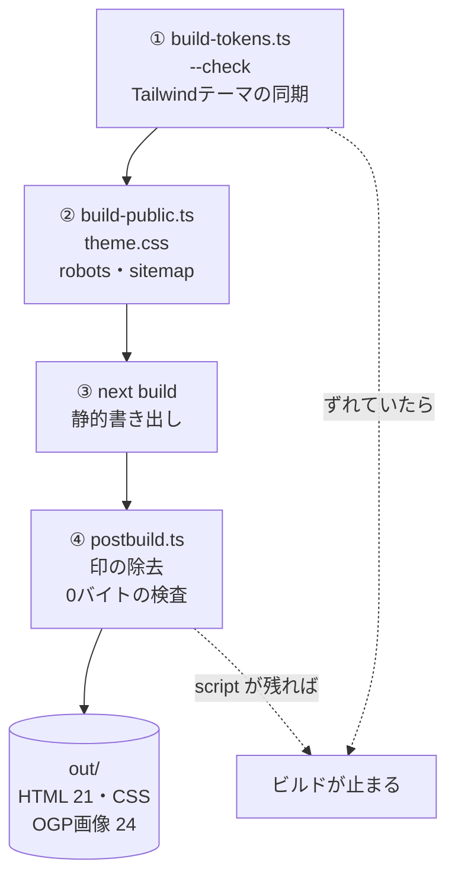
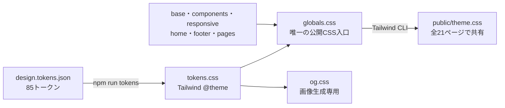
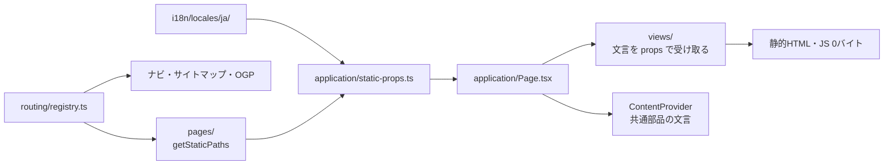

# 紬サイト ── Next.js + React + TypeScript

サービスサイト本体。21ページ、**実行時 JavaScript 0バイト**。
ここには**コードを触るときの決まり**だけを書く。引き継ぎの入口は [AGENTS.md](../AGENTS.md)、いまの状態と残課題は [docs/status.md](../docs/status.md)。理由や経緯は [docs/](../docs/README.md)（技術の判断は [docs/architecture/](../docs/architecture/README.md)）。全体の図は [リポジトリ直下の README](../README.md)。

```bash
npm ci
npm run dev              # http://localhost:3000 （href="terms.html" のままのリンクも踏める）
npm run build            # トークン同期の検査 → public/ の生成 → next build → postbuild → out/
npm run verify           # 標準仕様の検査（ブラウザ実測を含む）。FAIL 0 で納品可
npm run verify -- --static   # 静的検査のみ（ブラウザ不要・CI向け。結果は verify-report.static.json）
npm run verify -- --write    # LCP実測値を src/content/measurements.ts に書き戻す
npm run verify -- --dist <path>  # 検査するディレクトリを差し替える（既定は out/）
npm run tokens           # styles/design.tokens.json → styles/tokens.css（--check で同期検査）
npm run og               # OGP画像とファビコン（文面を変えたときだけ。差分をコミットする）
npm run check            # 型・依存方向・循環・文言とルートの検査
```

---

## ビルドの流れ（`npm run build`）

4段階を順に回し、**どこかで崩れていたらその場で止まる。**



| 段階 | やること | 止まる条件 |
|---|---|---|
| ① `build-tokens.ts --check` | `styles/design.tokens.json` と `styles/tokens.css` が一致するか | 手で `tokens.css` を直した・`npm run tokens` を忘れた |
| ② `build-public.ts` | `styles/globals.css` を Tailwind CLI で `public/theme.css` にコンパイルし、`robots.txt`・`sitemap.xml` を書く | CSSコンパイル失敗 |
| ③ `next build` | 21ページを `out/` に書き出す（型検査を含む） | 型エラー |
| ④ `postbuild.ts` | `data-next-head` などの印を消し、JSON-LD 以外の `<script>` と `<!-- -->` を数え、`out/_next/` を消す | 1件でもあれば |

### CSS の中央管理（Tailwind CSS 4.3.3）



- 色・書体・寸法は `styles/design.tokens.json` が正本。`npm run tokens` で `@theme` を生成する。`tokens.css`・`public/theme.css` は手で編集しない。
- 共通部品の見た目は `styles/` の意味を持つクラスに `@apply` で定義する。ページのJSXにはクラス名を渡す。`source(none)` により、ページ内の文字列から偶然ユーティリティを生成しない。
- 各CSSは `globals.css` からだけ読む。`theme → base → components → screens → overrides → utilities` の順。既存のリセットを維持し、Preflightを追加しない。
- カード幅など役割のある寸法は `w-container`、色は `text-ink`、書体は `font-brand` などテーマのユーティリティを使う。用途固有の値は `styles/` 内の任意値で指定できる。
- グラデーション・キーフレーム・複雑な状態セレクターなどは同じCSS内に置く。SVGの座標・図形属性は図解データに残し、意味を持つ色は共通CSS変数で供給する。
- JSXの `style` は比較バーの比率・表の指定幅というデータを渡すCSS変数だけ。静的なスタイル、CSS Modules、`<style>` の持ち込みは `npm run check` が止める。
- `npm run dev` はテーマ生成・Tailwind監視・Nextをまとめて起動／終了する。JSONとCSSの変更は自動コンパイルされ、CSSはブラウザの再読み込みで反映する。単独実行は `npm run styles` / `npm run styles:watch`。
- `styles/og.css` も同じテーマとTailwindで画像生成時にコンパイルする。通常のページには配らない。字形の正本が未確定のため、OGPの変更検証は `npm run og -- --out <一時ディレクトリ>` で行い、既存PNGを不用意に上書きしない。

設計の理由と移行時の確認は [ADR 0009](../docs/architecture/0009-global-tailwind.md) を参照。

---

## 検査の流れ（`npm run verify`）


- **静的検査**：電話番号・JSON-LD・実行時JSなし・内部リンク・CSS変数・価格・トークンの同期・OGP画像など。**ブラウザ実測**：LCP・横スクロール・タップ領域・コントラスト・図の色・コンソールエラー
- **1件でも FAIL があれば終了コード 1**（納品しない）。項目の一覧は [docs/spec.md](../docs/spec.md)
- ページに出す件数は、**ビルドした時点**の `verify-report.json` から取る。数字を最新にするなら `npm run build && npm run verify && npm run build`
- 簡易版（`--static`）の結果は別のファイルに書くので、回しても件数は変わらない

---

## Pages Router で書く（App Router にしない）

App Router は静的書き出しでも全ページに約173KB（gzip）の JS が載り、「実行時JS 0バイト」が崩れる。
測った結果と、`unstable_` を使うリスクの囲い方は [ADR 0001](../docs/architecture/0001-pages-router.md)。

- Next.js を上げるときは `npm run build && npm run verify` が通ることを確かめてから。通らなければ上げない
- 開発サーバー（`npm run dev`）の HTML には、ホットリロード用の script が入る。**0バイトの対象は `out/`（納品物）**

---

## 編集する場所と書き方

| 変更 | 正本 |
|---|---|
| 本文・見出し・SEO・共通文言・図のラベル | `src/i18n/locales/ja/`。ページ名・用途別の名前空間 |
| OGP画像の文面 | `src/i18n/locales/ja/og.ts`。金額は `content/og.ts` が価格データから差し込む |
| 連絡先・公開前設定 | `src/content/config.ts`。表示用プロフィールは `i18n/locales/ja/config.ts` |
| 金額・計算 | `src/content/prices.ts`。BUILD・RUNは安定したキーで引く |
| 実測値 | `src/content/measurements.ts`。`verify --write` が数値だけを更新する |
| ページ追加・URL・アイコン・ナビ分類 | `src/routing/registry.ts` |
| ページの構造 | `src/views/`。`PageProps<'home'>` など、当該ページ用の文言だけを描画する |
| 暫定ヒーロー画像 | `assets/hero/onokoro.webp`。`build-public.ts` が `public/images/onokoro-hero.svg` に内包。コピーと代替説明は `i18n/locales/ja/home.ts` の `hero`（[ADR 0005](../docs/architecture/0005-temporary-hero.md)） |
| 静的生成の入口 | `src/pages/index.tsx`・`404.tsx`・`[page].tsx`。全入口に `unstable_runtimeJS: false` |
| props の用意とテンプレート選択 | `src/application/`。ファイルシステムは `getStaticProps` からだけ読む |
| 共通表示 | `src/layouts/`・`src/components/`。文言は `ContentProvider` で配布 |
| SVGの座標・色・図形 | `src/content/diagrams.ts`。文字はカタログ |
| CSS | `styles/`。トークンは `design.tokens.json` が正本 |
| 配布ファイル | `out/`。手で編集しない |

`pages → application → views → layouts → components → content → i18n → routing → lib`

右側から左側への import と循環は禁止。`src/` の import は `@/` を使う。ビルド・検査ツールは content・i18n・routing・lib を利用できる。



- 文言のキーは並べ替えや修正で改番しない。文言の変更はカタログで行う。
- 値を含む文は `format(copy.heading, { amount, months })`。差し込み名は型検査される。文字列を分割して並べると React の区切りコメントが出るため、1つの文に組み立てる。
- 本文中のリンクは `@route:terms` などの識別子。コードからは `href('terms')` を使う。深い404からも辿れる `/terms.html` に解決する。
- 電話リンクは `<PhoneLink className="btn btn-1" />`。表示番号と発信先を別々に書かない。
- `<strong>` 入りの信頼済み本文だけを `raw()` に渡す。外部入力は対象外。
- `next/link` のクライアント遷移は使わず、通常のリンクで移動する。
- 現在は日本語のみ・1ビルド1言語。未対応言語はエラーにする。追加時の条件は [ADR 0004](../docs/architecture/0004-content-and-routing.md) に記載。

### ページを追加するとき

1. `routing/registry.ts` に ID・アイコン・ナビの分類を追加する。
2. 日本語カタログと `views/` のテンプレートを作り、`application/Page.tsx` の分岐に登録する。
3. `og.ts` の文言を追加し、定めた書体環境で共有カードを用意する。
4. `npm run validate` と `npm run verify` を通す。URLとOGPの登録漏れ、文字の直接記述、循環、JS混入は検査で止まる。

ルート・文言・レイアウトを別々に追える構成にした理由と互換性の条件は [ADR 0004](../docs/architecture/0004-content-and-routing.md)。

## 開発ライブラリと実行環境

Node.js 24 系を使います（`.nvmrc` と `package.json` の `engines`、CI、Vercel で共通）。
初回は `nvm install && nvm use`、`npm install --global npm@12.0.2`、続けて `npm ci` を実行してください。npm 12.0.2 は `packageManager`・CI・Vercel のインストール指定で統一しています。

| 用途 | ライブラリ／コマンド |
|---|---|
| コンパイルと型検査 | TypeScript 7.0.2（`@typescript/native` の `tsc`） |
| 検査ツール用の互換 API | `typescript` は `@typescript/typescript6` 6.0.3 の npm alias |
| React のアイコン | `lucide-react`。SVG はビルド時に描画 |
| 条件付きの CSS クラス | `clsx` |
| 外部データの構造検証 | `zod`。実測レポートの値を検証 |
| コード検査 | ESLint 9 の最新互換版 + `eslint-config-next`。`npm run lint` |
| 単体テスト | Vitest。`npm test`／`npm run test:watch` |
| ブラウザ実測 | Playwright。`npm run verify` |
| 整形 | Prettier。`npm run format`／`npm run format:check`（既存ファイルの一括整形は任意） |
| 配備 | Vercel CLI。`npm run deploy:preview`／`npm run deploy:production` |

`npm run validate` は型・依存方向・lint・単体テスト・ビルド・静的検査をまとめて実行します。
CI は追加で Chromium の実測検査も行います。テストや設定ファイルも TypeScript で管理します。
Vercel は `site/` を Root Directory に設定し、`vercel.json` で `out/` だけを配信します。

ESLint 10 は Next.js が使う React/import/a11y プラグインのサポート範囲外のため、9.39.5 を使います。
TypeScript 7 の CLI と互換 API の併用理由、依存の overrides は [ADR 0003](../docs/architecture/0003-modern-stack.md) を参照してください。
