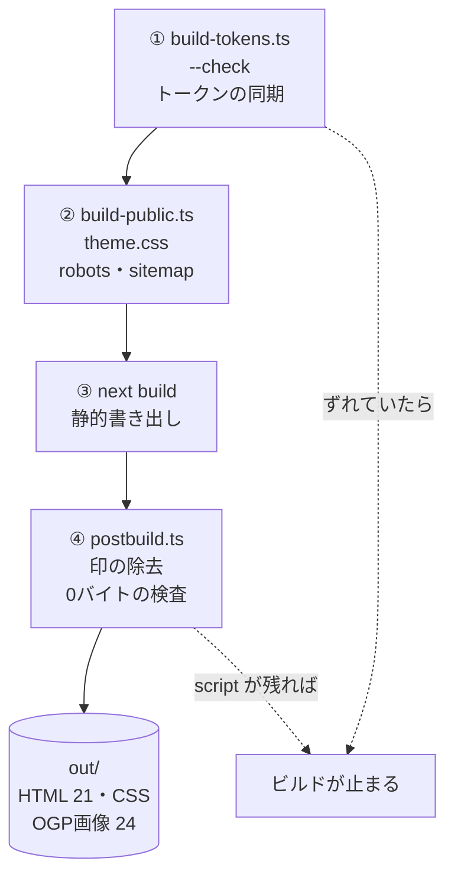
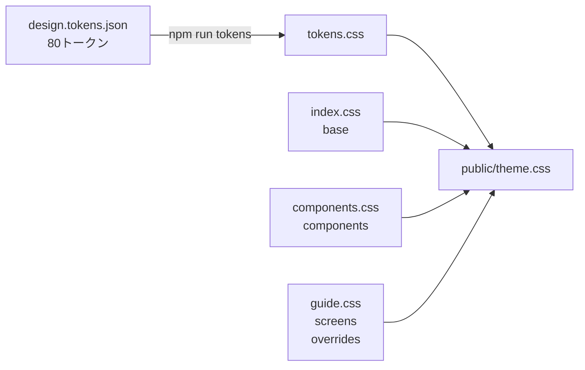
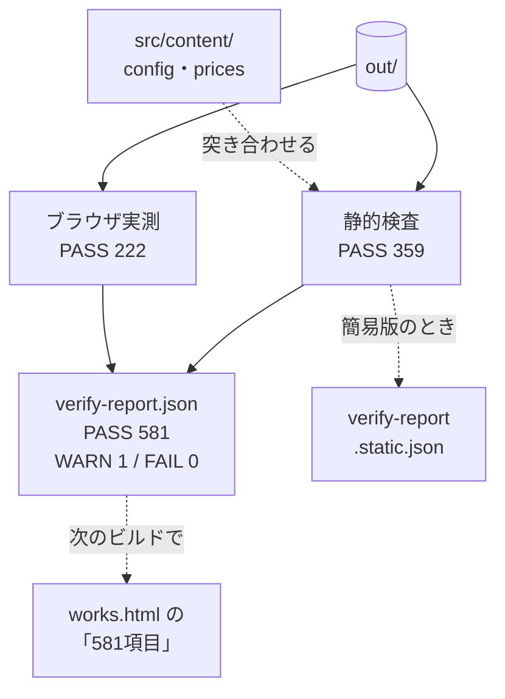
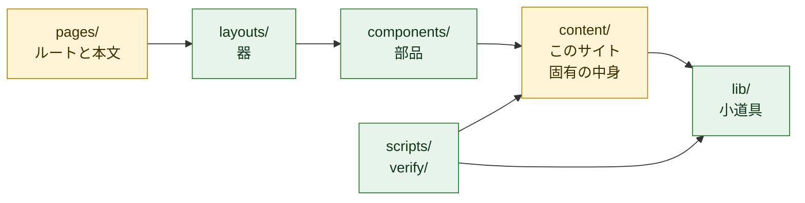

# 紬サイト ── Next.js + React + TypeScript

サービスサイト本体。21ページ、**実行時 JavaScript 0バイト**。
ここには**コードを触るときの決まり**だけを書く。引き継ぎの入口は [AGENTS.md](../AGENTS.md)、いまの状態と残課題は [docs/status.md](../docs/status.md)。理由や経緯は [docs/](../docs/README.md)（技術の判断は [docs/architecture/](../docs/architecture/README.md)）。全体の図は [リポジトリ直下の README](../README.md)。

```bash
npm install
npm run dev              # http://localhost:3000 （href="terms.html" のままのリンクも踏める）
npm run build            # トークン同期の検査 → public/ の生成 → next build → postbuild → out/
npm run verify           # 標準仕様の検査（ブラウザ実測を含む）。FAIL 0 で納品可
npm run verify -- --static   # 静的検査のみ（ブラウザ不要・CI向け。結果は verify-report.static.json）
npm run verify -- --write    # LCP実測値を src/content/config.ts に書き戻す
npm run verify -- --dist <path>  # 検査するディレクトリを差し替える（既定は out/）
npm run tokens           # styles/design.tokens.json → styles/tokens.css（--check で同期検査）
npm run og               # OGP画像とファビコン（文面を変えたときだけ。差分をコミットする）
npm run check            # 型検査 ＋ ディレクトリの依存の向きの検査
```

---

## ビルドの流れ（`npm run build`）

4段階を順に回し、**どこかで崩れていたらその場で止まる。**



| 段階 | やること | 止まる条件 |
|---|---|---|
| ① `build-tokens.ts --check` | `styles/design.tokens.json` と `styles/tokens.css` が一致するか | 手で `tokens.css` を直した・`npm run tokens` を忘れた |
| ② `build-public.ts` | `styles/` の4枚を `public/theme.css` に束ね、`robots.txt`・`sitemap.xml` を書く | — |
| ③ `next build` | 21ページを `out/` に書き出す（型検査を含む） | 型エラー |
| ④ `postbuild.ts` | `data-next-head` などの印を消し、JSON-LD 以外の `<script>` と `<!-- -->` を数え、`out/_next/` を消す | 1件でもあれば |

### CSS の流れ



色や寸法は `design.tokens.json` を直して `npm run tokens`。`tokens.css` と `public/theme.css` は手で編集しない。

---

## 検査の流れ（`npm run verify`）



- **静的検査**：電話番号・JSON-LD・実行時JSなし・内部リンク・CSS変数・価格・トークンの同期・OGP画像など。**ブラウザ実測**：LCP・横スクロール・タップ領域・コントラスト・図の色・コンソールエラー
- **1件でも FAIL があれば終了コード 1**（納品しない）。項目の一覧は [docs/spec.md](../docs/spec.md)
- ページに出す件数は、**ビルドした時点**の `verify-report.json` から取る。数字を最新にするなら `npm run build && npm run verify && npm run build`
- 簡易版（`--static`）の結果は別のファイルに書くので、回しても件数は変わらない

---

## Pages Router で書く（App Router にしない）

App Router は静的書き出しでも全ページに約173KB（gzip）の JS が載り、「実行時JS 0バイト」が崩れる。
測った結果と、`unstable_` を使うリスクの囲い方は [ADR 0001](../docs/architecture/0001-pages-router.md)。

- Next.js を上げるときは `npm run build && npm run verify` が通ることを確かめてから。通らなければ上げない
- 開発サーバー（`npm run dev`）の HTML には、ホットリロード用の script が入る。**0バイトの対象は `out/`（納品物）**

---

## 書き方の決まり

| 決まり | 理由 |
|---|---|
| **全ページに `export const config = { unstable_runtimeJS: false }`** | 忘れると postbuild で落ちる |
| **値を混ぜる文字列はテンプレートリテラルで1つにする**（`` {`ほか${n}項目`} ``） | `ほか{n}項目` と書くと React が `ほか<!-- -->5<!-- -->項目` を出し、検査の文字列照合がずれる。postbuild で落ちる |
| HTML 文字列（`<strong>` 入りの本文）は `dangerouslySetInnerHTML={raw(…)}` | 本文は Python 版から HTML 文字列のまま移した。自前のデータだけを渡す |
| 図は `<Figure svg={D.landVsOwn()} />` | `content/diagrams.ts` は `<figure>` ごと文字列で返す。外側だけ要素にして中身を流し込む |
| `node:fs` は `getStaticProps` の中だけ | ページ本体から使うとクライアント用の束の作成で落ちる |
| `next/link` と `next/image` は使わない | どちらも実行時JSか画像サーバーを前提にしている。静的HTMLには不要 |
| ページ名はフラットな `.html`、内部リンクも `href="terms.html"` | どのホスティングでも確実に動く。クリーンURLはホスト側の設定でやる |

---

## 構成

| | |
|---|---|
| `src/pages/*.tsx` | 1ファイル＝1ページ。業種4枚は `[industry].tsx` から出る |
| `src/pages/_document.tsx` | ページに依らない head（テーマ色・アイコン・CSS）と `<html lang="ja">` |
| `src/layouts/Base.tsx` | **器の本体。**ページごとの head / OGP / JSON-LD / ヘッダー / フッター / 固定CTA |
| `src/components/*.tsx` | Section / Table / Note / Calc / Flow / Stats / Acc / Cta / Entry / Plans / Cards / Vs / Figure / Icon |
| `src/content/config.ts` | **屋号・エリア・連絡先・テーマ。別ブランドに振り替えるときはここだけ編集する** |
| `src/content/prices.ts` | **価格の単一の出所。**全ページがここを参照するので、値を変えると表記が一斉に変わる。`as const` で値から型が付く。添字ではなく `build(key)` / `run(key)` で引く |
| `src/lib/icons.ts` | Lucide（lucide-static v0.454.0, ISC）のパス。**使うアイコンはここに足す** |
| `src/content/nav.ts` / `industries.ts` / `spec.ts` | ナビ・業種・仕様の並び |
| `src/content/diagrams.ts` | **図。手書きのインラインSVG** |
| `styles/design.tokens.json` | **色・寸法・書体の正本（DTCG 2025.10 形式・80トークン）** |
| `styles/tokens.css` | **生成物（`npm run tokens`）。手で編集しない** |
| `styles/index.css` | 基礎層（`@layer base`）。面・文字・余白の土台とテーマの割り当て |
| `styles/components.css` | 部品層（`@layer components`）。C01–C24 に対応 |
| `styles/guide.css` | 画面層（`@layer screens` / `overrides`）。768px の切り替えとページ固有の余白 |
| `public/fonts/` | League Gothic（OFL・latinサブセット 10KB）。**外部フォントは読み込まない** |
| `public/og/` | `npm run og` の生成物（コミットする）。ビルドはそのまま `out/og/` に出す |
| `public/theme.css` `robots.txt` `sitemap.xml` | `scripts/build-public.ts` の生成物（コミットしない）。CSS の正本は `styles/` |
| `scripts/` | `build-public.ts`（theme.css / robots.txt / sitemap.xml）・`postbuild.ts`（0バイトの番人）・`build-tokens.ts`・`og.ts`・`check-structure.ts`（依存の向き） |
| `verify/` | **標準仕様の自動検査。これが仕様の実体**（項目の一覧は [docs/spec.md](../docs/spec.md)） |
| `out/` | 出力（静的HTML・CSS・robots.txt・sitemap.xml）。これを置けば公開できる |
| `verify-report.json` | 検査結果（全項目）。ページに出す件数はここから取る。`--static` の結果は `verify-report.static.json` |

### 置き場所の決まり

依存は一方向。**矢印の向きにだけ import してよい。**`npm run check`（`scripts/check-structure.ts`）が検査する。

```
pages → layouts → components → content → lib
```



黄色は**別の案件で差し替える**もの、緑は**そのまま使う**もの。飛び越える import（`pages` から `lib` など）はしてよい。逆向きは不可。

| | 何を置くか | 別の案件では |
|---|---|---|
| `src/content/` | 屋号・料金・ナビ・業種・仕様・図。**このサイトに固有の中身** | **差し替える**（同じ形の export を保つ） |
| `src/pages/` | ルートと本文 | 差し替える |
| `src/components/` `src/layouts/` | 部品と器 | そのまま使う |
| `src/lib/` | 何にも依存しない小道具（HTML の流し込み・アイコン・丸め・検査結果の読み込み） | そのまま使う |
| `styles/` `scripts/` `verify/` | CSS・ビルド・検査 | そのまま使う（`scripts/og.ts` の文面だけ差し替える） |

- `src/` の中は **`@/…` で import する**（例：`@/content/prices`）。置き場所を変えても import を書き換えずに済む
- 部品と器が `content/` を読むのは `config`・`nav`・`prices` の3つだけ。別の案件ではこの3つの形を保てば、部品はそのまま動く
- 層を分けた理由と、検討してやめた選択肢は [ADR 0002](../docs/architecture/0002-directory-layers.md)
